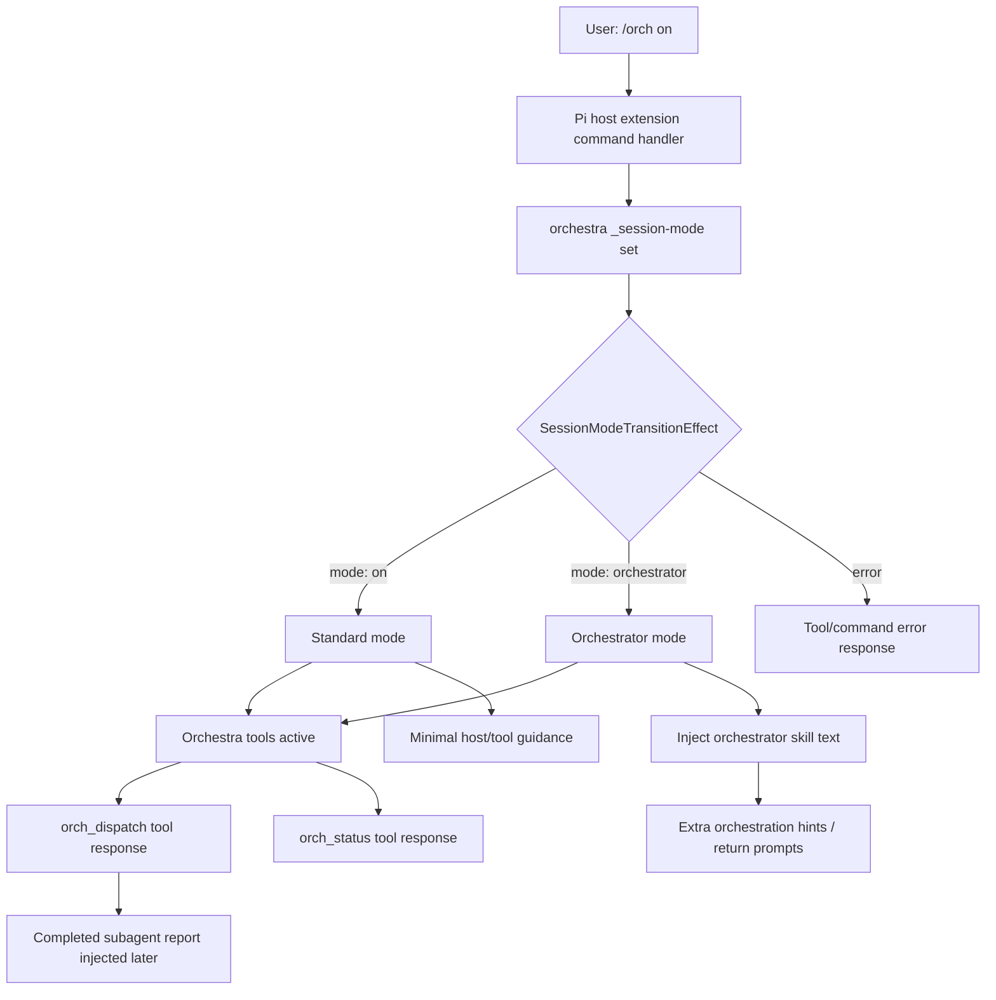
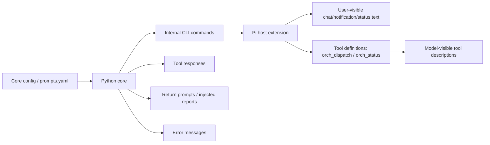
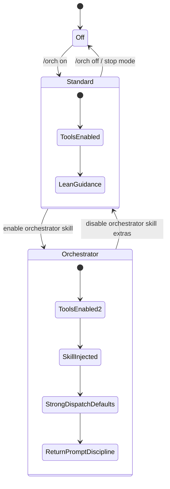

# Orchestra Prompt Flow Map

Draft evaluation map for hints, return prompts, tool responses, command output, and mode-specific prompt injection.

## High-level `/orch on` flow

## Message source map

## Working distinction

| Category | What it is | Typical trigger | Evaluation question |
|---|---|---|---|
| Tool response | Direct result of calling `orch_dispatch` or `orch_status` | Model invokes tool | Is this concise and actionable enough? |
| Return prompt | Text injected after async subagent completion | Subagent finishes | Does it guide the parent without duplicating work? |
| Hint | Model-visible guidance nudging workflow | Tool metadata, prompts, mode injection | Does it belong in standard mode or orchestrator mode? |
| Command output | User-visible `/orch ...` command result | User invokes host command | Is it clear to humans without overprompting the model? |
| Error message | Failure text from host/core/tool boundary | Bad args, failed subprocess, config issue | Does it name the fix or next action? |

## Candidate mode split

## Current code landmarks

- `extensions/pi/orchestra/index.ts`
  - `MainSessionMode = "off" | "on" | "orchestrator"`
  - `setOrchestraToolsActive(...)`
  - `injectOrchestratorSkill(...)`
  - host command handling for `/orch on` and mode effects
- `src/orchestra/cli.py`
  - internal `_session-mode` command
  - internal `_tool-info` command
  - host-facing help and command plumbing
- `prompts.yaml`
  - likely main editing surface for reusable prompt/message text

## Cleanup pass questions

1. Which text should be human-facing only, model-facing only, or both?
2. Which messages should remain in `prompts.yaml` versus host/core code?
3. Should `/orch on` mean standard tools-only mode, with a second explicit action for orchestrator mode?
4. Which orchestrator-mode extras are genuinely useful enough to justify more prompt weight?
