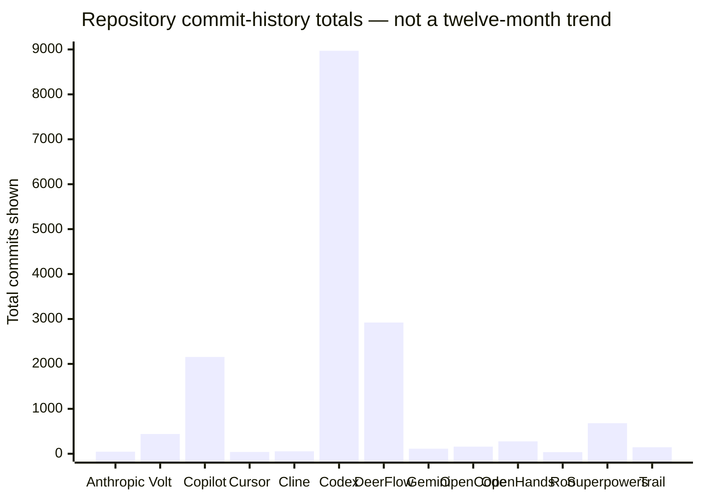

# Evaluating Downloaded AI Agent Skill Repositories

## Executive summary

The repositories are not directly comparable products. They fall into four different classes:

| Class | Repositories | Consequence for evaluation |
|---|---|---|
| Coherent software-development methodology | `superpowers` | Skills are designed to work together as a lifecycle rather than as isolated prompts. |
| Specialist skill suites | `trailofbits-skills`, `deer-flow`, `gemini-skills`, `cline-skills`, `openhands-extensions` | Strongest when used for their intended domain: security, research, API development, review orchestration, or PR automation. |
| Broad community catalogs | `awesome-agent-skills`, `awesome-copilot`, `awesome-cursor-skills`, `opencode-skills` | High breadth, but quality and provenance vary by item; installation should be selective. |
| Reference, adapter, or internal implementation repositories | `anthropics-skills`, `codex`, `rooskills` | Valuable patterns and selected skills, but not necessarily the best complete portable suite for the requested lifecycle. |

For the requested use case—**orchestration, research, code review, verification, security review, code building, and code planning**—the strongest composite installation is:

1. **Superpowers** for design, planning, task orchestration, test-driven implementation, debugging, code review, and completion verification.
2. **DeerFlow** for deep research and repository research.
3. **Trail of Bits Skills** for security-focused differential review, false-positive verification, insecure-default analysis, static analysis, and specification-to-code compliance.
4. **OpenHands Extensions** for the persistent PR-to-green orchestration loop and reusable code-review workflow.
5. **Awesome Copilot**, selectively, for broad security and compliance review skills.
6. **Cline `review-team`** where the harness supports parallel reviewer subagents.

This combination is preferable to installing an entire large catalog. Superpowers provides a coherent development control plane; DeerFlow fills the research gap; Trail of Bits adds security-engineering depth; OpenHands adds an operational verification loop; Awesome Copilot and Cline contribute specialized review lenses.

The strongest evidence of actual effectiveness is uneven:

- **Gemini Skills** reports an official evaluation in which adding its Gemini API skill raised best-practice API-code correctness to **87% with Gemini 3 Flash and 96% with Gemini 3.1 Pro**. This is the clearest numerical result, but it applies narrowly to Gemini API development rather than general coding. citeturn18view3turn18view4
- **Superpowers** documents a dedicated behavioral-evaluation harness for testing skill behavior, separately from plugin-infrastructure tests. Its workflow also explicitly requires test-first development, two-stage review, and evidence before completion. citeturn17view0
- **Trail of Bits** reports a concrete timing side-channel found using its `constant-time-analysis` skill and requires contributors to run a local command covering most CI. This is meaningful real-world evidence, although it is not a controlled benchmark. citeturn18view0turn18view1
- **DeerFlow** and **OpenHands Extensions** contain dedicated test directories and operational infrastructure, but the available primary-source material does not establish that every skill has a controlled behavioral benchmark. citeturn22view4turn22view6
- No authoritative, independent benchmark was found that evaluates all thirteen repositories on the same tasks, models, harnesses, repositories, budgets, and success criteria. GitHub stars therefore measure attention and adoption, not task effectiveness.

My overall ranking for this specific use case is:

| Rank | Repository | Composite | Primary reason |
|---:|---|---:|---|
| 1 | Superpowers | 94 | Best coherent end-to-end coding methodology and strongest general behavioral-evaluation story. |
| 2 | Trail of Bits Skills | 87 | Best security-review and adversarial-verification depth. |
| 3 | Awesome Copilot | 86 | Broad, mature review/security catalog with strong repository engineering, but community quality varies. |
| 4 | DeerFlow | 86 | Best research-oriented skills and strong long-horizon agent infrastructure. |
| 5 | OpenHands Extensions | 81 | Excellent PR iteration and verification automation; comparatively smaller adoption. |
| 6 | Anthropic Skills | 77 | Authoritative skill-format reference and good meta-skills, but not a complete coding lifecycle. |
| 7 | Codex | 73 | Extremely mature engineering repository, but its included skills are mostly internal and repository-specific. |
| 8 | Awesome Agent Skills | 70 | Enormous discovery surface, but it is an index rather than a uniformly tested suite. |
| 9 | OpenCode Skills | 70 | Broad coding coverage and structural validation, but limited independent evidence and smaller community. |
| 10 | Cline Skills | 70 | `review-team` is unusually relevant; the remainder is mostly domain and integration skills. |
| 11 | Gemini Skills | 67 | Best quantified narrow-domain result, but only four current skills and limited lifecycle coverage. |
| 12 | Awesome Cursor Skills | 63 | Several concise, useful orchestration and verification skills, but little repository-level behavioral testing. |
| 13 | RooSkills | 52 | Useful Roo adapter and generation tooling, but low maturity and largely inherited or generated content. |

These scores are a transparent analytical model, not externally published benchmark scores.

## Scope, identities, and scoring method

The evaluation snapshot is **August 7, 2026**. Repository names were resolved as follows:

| Downloaded name | Repository evaluated |
|---|---|
| `anthropics-skills` | [anthropics/skills](https://github.com/anthropics/skills) |
| `awesome-agent-skills` | [VoltAgent/awesome-agent-skills](https://github.com/VoltAgent/awesome-agent-skills) |
| `awesome-copilot` | [github/awesome-copilot](https://github.com/github/awesome-copilot) |
| `awesome-cursor-skills` | [spencerpauly/awesome-cursor-skills](https://github.com/spencerpauly/awesome-cursor-skills) |
| `cline-skills` | [cline/skills](https://github.com/cline/skills) |
| `codex` | [openai/codex](https://github.com/openai/codex) |
| `deer-flow` | [bytedance/deer-flow](https://github.com/bytedance/deer-flow) |
| `gemini-skills` | [google-gemini/gemini-skills](https://github.com/google-gemini/gemini-skills) |
| `opencode-skills` | [farmage/opencode-skills](https://github.com/farmage/opencode-skills) |
| `openhands-extensions` | [OpenHands/extensions](https://github.com/OpenHands/extensions) |
| `rooskills` | [Kastalien-Research/rooskills](https://github.com/Kastalien-Research/rooskills) |
| `superpowers` | [obra/superpowers](https://github.com/obra/superpowers) |
| `trailofbits-skills` | [trailofbits/skills](https://github.com/trailofbits/skills) |

`opencode-skills` is the one ambiguous local name. This report maps it to `farmage/opencode-skills`, the repository describing itself as an OpenCode adaptation containing 66 specialized skills and workflow commands. citeturn17view6turn18view8

### Scoring dimensions

The composite score uses four dimensions:

| Dimension | Weight | What was evaluated |
|---|---:|---|
| Reliability | 30% | Recent maintenance, CI, structural validation, test infrastructure, behavioral evaluations, deterministic verification requirements. |
| Coverage | 30% | Direct coverage of orchestration, research, code review, verification, security review, code building, and code planning. |
| Maturity | 20% | Adoption, forks, commit history, release machinery, contributor/community evidence, and integration breadth. |
| Trustworthiness | 20% | Provenance, license clarity, security policy, audit methodology, evidence requirements, real-world findings, and warnings about third-party content. |

Stars and forks were log-normalized conceptually rather than treated linearly. A repository with 200,000 stars was not considered ten times more effective than one with 20,000 stars. Catalog repositories also received a reliability discount because catalog size does not establish that each indexed skill was reviewed or tested.

### Important measurement limitations

GitHub’s unauthenticated repository pages exposed stars, forks, watchers, open issue counts, total commit-history counts, licenses, and repository structure reasonably consistently. They did **not** reliably expose exact contributor totals, exact closed-issue totals, repository-wide file counts, repository-wide lines of code, or complete twelve-month monthly commit series for every repository.

Those fields are therefore marked **unspecified** rather than estimated. GitHub’s repository “size” field was not substituted for LOC because it represents repository storage, not logical source lines.

The requested commits-per-month line chart could not be produced reliably for all thirteen repositories from the primary-source pages. A total commit-history chart is included as an activity-scale reference, but it must not be interpreted as a twelve-month trend or as productivity.

## Repository metrics and engineering health

### GitHub and licensing snapshot

| Repository | Stars | Forks | Watchers | Open issues shown | Total commits shown | License | Latest exact commit verified |
|---|---:|---:|---:|---:|---:|---|---|
| Anthropic Skills citeturn19view0 | 166.7k | 19.9k | 1.1k | 311 | 46 | Mixed: many Apache-2.0; document skills source-available | July 24, 2026 |
| Awesome Agent Skills citeturn9view1turn17view4 | 29.7k | 3.2k | 225 | 0 | 439 | MIT | Unspecified |
| Awesome Copilot citeturn19view1 | 37.5k | 4.7k | 341 | 41 | 2,155 | MIT | Unspecified |
| Awesome Cursor Skills citeturn6view3turn20search5 | 659 | 103 | 6 | 0 | 41 | CC0-1.0 | Unspecified |
| Cline Skills citeturn17view5turn23view0 | 18 | 3 | 1 | 0 | 54 | Apache-2.0 | Unspecified |
| Codex citeturn22view0turn22view1turn14view5 | 104.4k | 15.8k | 547 | 5k+ | 8,970 | Apache-2.0 | August 6, 2026 |
| DeerFlow citeturn22view3turn22view4turn14view6 | 79.4k | 10.9k | 333 | 592 | 2,921 | MIT | August 6, 2026 |
| Gemini Skills citeturn18view4 | 3.9k | 395 | 39 | 5 | 112 | Apache-2.0 | Unspecified |
| OpenCode Skills citeturn22view7turn18view8 | 100 | 19 | 1 | Not shown | 158 | MIT | Unspecified |
| OpenHands Extensions citeturn22view5turn22view6 | 134 | 67 | 4 | 42 | 276 | MIT | August 6, 2026 |
| RooSkills citeturn18view9 | 17 | 1 | 0 | Not shown | 36 | Per-skill; mostly MIT according to README | Unspecified |
| Superpowers citeturn17view0turn14view11 | 268.0k | 24.0k | 1.0k | 146 | 680 | MIT | August 6, 2026 |
| Trail of Bits Skills citeturn17view1turn18view0 | 6.5k | 558 | Unspecified | 22 | 145 | CC-BY-SA-4.0 | Unspecified |

The Anthropic repository requires special licensing care. Anthropic states that many skills are Apache-2.0, while its DOCX, PDF, PPTX, and XLSX skills are source-available rather than open source. Anthropic also characterizes the repository as demonstration and educational material and explicitly says critical users should test skills in their own environments. citeturn19view0

Trail of Bits’ CC-BY-SA-4.0 license is clear but less permissive than MIT or Apache-2.0. Organizations intending to modify and redistribute those skills inside proprietary products should have the share-alike implications reviewed. citeturn18view0

### Releases, CI, tests, and behavioral evaluation

| Repository | Release cadence | CI or validation indicators | Behavioral skill-test evidence | Repository files / LOC |
|---|---|---|---|---|
| Anthropic Skills | No annual rate verified | Repository actions and a sophisticated `skill-creator` evaluation tool exist | Evaluation tooling exists; repo-wide behavioral coverage not established | Unspecified |
| Awesome Agent Skills | No annual rate verified | Catalog maintenance and curation; no uniform upstream CI guarantee | No repository-wide behavioral suite verified | Unspecified |
| Awesome Copilot | No annual rate verified | GitHub Actions, schemas, contribution validation, security policy | No controlled cross-skill behavioral suite verified | Unspecified; selected skills expose LOC |
| Awesome Cursor Skills | No annual rate verified | Actions present; little evidence of extensive validation | No behavioral suite verified | Unspecified; examples range roughly 37–66 LOC |
| Cline Skills | No tagged release cadence verified | Repository structure plus upstream submodules; main Cline integration issues exist | No repo-wide behavioral suite verified | Unspecified |
| Codex | Very high; multiple releases and prereleases during active periods | Large production CI and integration-test infrastructure | Strong Codex software tests; included `SKILL.md` files are mostly internal workflows | Unspecified |
| DeerFlow | Active tagged releases; exact annual count unspecified | `tests/skills`, pre-commit config, changelog, Actions | Skill-test directory verified; breadth of behavioral assertions unspecified | Unspecified |
| Gemini Skills | No annual rate verified | Security policy and official evaluation process | Yes, official task evaluation for Gemini API development | Unspecified |
| OpenCode Skills | No annual rate verified | `make validate` checks YAML, names, and cross-references | Structural validation, not demonstrated behavior evaluation | Unspecified |
| OpenHands Extensions | Release automation present; annual count unspecified | Tests directory, release-please configuration, plugin/skill registry validation | Activation and extension-integration fixtures exist; quality benchmark coverage unspecified | Unspecified |
| RooSkills | NPM release documentation; annual rate unspecified | CI on pushes/PRs, secret checks, package checks, CLI tests, provenance | No independent skill-effectiveness suite verified | Unspecified |
| Superpowers | Active tagged releases; annual count unspecified | Pre-commit, plugin tests, skill-authoring methodology | Explicit behavioral drill-evaluation harness | Unspecified |
| Trail of Bits Skills | No annual rate verified | `make check` runs most CI locally, pre-commit, security policy | Strong verifier patterns; no universal controlled benchmark verified | Unspecified |

Superpowers distinguishes **skill-behavior evaluations** from plugin infrastructure tests. Its README says skill behavior uses the external `superpowers-evals` drill harness, while plugin tests live under `tests/`. This separation is a strong engineering signal because a skill can be syntactically valid and still fail to alter agent behavior as intended. citeturn17view0

OpenCode’s `make validate` verifies frontmatter and cross-references, which is useful for package integrity, but it does not establish that an LLM follows the workflow or produces better code. citeturn18view8

RooSkills documents CI checks for exposed secrets, package integrity, CLI functionality, package size, version changes, and NPM provenance. These are useful supply-chain and packaging controls, but they test the adapter/package more than the reasoning quality of each skill. citeturn18view9

### Commit-history scale



Codex and DeerFlow are full agent software systems, while several others are mostly Markdown catalogs, so raw commit totals are structurally biased in favor of the larger applications. Codex showed 8,970 commits and DeerFlow 2,921; Superpowers showed 680; Awesome Copilot 2,155. citeturn22view0turn22view4turn17view0turn19view1

**Cannot verify from authoritative sources:** complete commits-per-month values for all twelve months and all thirteen repositories. The GitHub pages available in this research did not expose a consistent primary-source monthly series. Anthropic’s history showed only a small number of commits in the most recent months, but a partial series would not support a fair cross-repository line chart.

## Effectiveness evidence and repository analysis

### Anthropic Skills

Anthropic’s repository is the most authoritative reference for the Agent Skills format among the evaluated repositories. It defines a skill as a self-contained folder containing `SKILL.md`, scripts, and resources, and supports Claude Code, Claude.ai, and the Claude API. It includes both simple examples and the production-derived document skills used for Claude’s document capabilities. citeturn19view0

Its strongest contribution to this use case is not an end-to-end coding workflow; it is **skill design and evaluation infrastructure**. The `skill-creator` skill supports creating, improving, evaluating, benchmarking, and packaging skills. `webapp-testing`, `mcp-builder`, and `claude-api` are useful specialized implementation skills.

The weakness is coverage. Anthropic Skills does not provide the same coherent planning–TDD–review–verification methodology as Superpowers, nor Trail of Bits’ security depth. Anthropic itself warns that repository behavior may differ from production Claude behavior and that users should test thoroughly before relying on the examples. citeturn19view0

**Assessment:** essential reference and meta-skill source; not the best sole install for a software-development agent.

### Awesome Agent Skills

VoltAgent’s repository is an enormous discovery index advertising more than 1,000 skills from official development teams and the community and compatibility with Claude Code, Codex, Gemini CLI, Cursor, and other harnesses. citeturn18view6turn17view4

Its breadth is its primary strength. It can locate skills for almost any framework, vendor, or workflow. Its weakness is that it is an **aggregator**, not a unified implementation. Stars on the catalog do not transfer to every linked skill, and a repository-level test suite cannot validate upstream content owned by hundreds of different sources.

The practical use is discovery and provenance comparison: prefer skills linked to official vendor teams, active security organizations, or repositories with behavior evaluations. Do not automatically install all indexed skills.

**Assessment:** best directory, not best execution suite.

### Awesome Copilot

Awesome Copilot combines community-contributed skills, agents, instructions, hooks, workflows, plugins, schemas, a searchable website, and machine-readable listings. Its repository has substantial activity, a security policy, contribution infrastructure, and a long contributor list. GitHub explicitly warns that the customizations come from third parties and should be inspected before installation. citeturn19view1

The security-review material is unusually useful. Its `security-review` skill covers injection, secrets, dependencies, authentication, and authorization through code and data-flow reasoning rather than only keyword matching. The MCP security-review skill asks for evidence tied to files and lines and incorporates OWASP-oriented analysis. citeturn11search0turn11search3turn11search6

The limitation is consistency. Being under the `github` organization gives the repository strong visibility and infrastructure, but the content remains community-contributed. There is no evidence that every skill received a controlled LLM evaluation.

**Assessment:** best broad supplementary catalog for review and security after selective inspection.

### Awesome Cursor Skills

Awesome Cursor Skills contains several compact skills that are more operationally interesting than the repository’s modest size suggests. `parallel-code-review` launches four read-only reviewers for security, performance, correctness, and readability; `best-of-n-solving` runs isolated approaches in separate worktrees; `grinding-until-pass` loops on tests/build/lint; and browser-oriented skills verify real UI behavior. citeturn20search0turn20search1turn20search2turn20search5

These skills follow useful agent-design principles: independent sampling, isolation through worktrees, explicit exit commands, and multi-lens review. The individual files are also concise: the reviewed examples ranged from 37 logical lines for `best-of-n-solving` to 66 for `parallel-code-review`. citeturn20search0turn20search1turn20search2turn20search3

The weakness is evaluation maturity. No repository-level behavioral test suite or external benchmark was verified.

**Assessment:** good source of lightweight Cursor-native tactics; several skills are worth porting, but not a primary lifecycle framework.

### Cline Skills

Cline’s repository says its skills work with any harness supporting the Agent Skills standard, including Cline, Claude Code, Cursor, OpenCode, Codex, and Pi. It documents the expected installation directory for each. citeturn23view0

`review-team` is the standout. It sends the same change to specialized reviewers covering correctness, security, architecture, conventions, simplicity, user experience, reliability, telemetry, testing, compatibility, and documentation. It can run once or iterate until clean. citeturn18view7turn23view0

Cline also includes useful agent-building and meta-skills: `building-pydantic-ai-agents`, `cline-sdk`, and an inherited `skill-creator`. Much of the rest of the repository consists of vendor or product integrations rather than the seven requested lifecycle categories. citeturn23view0

There have also been integration reports in the broader Cline issue tracker concerning skill discovery and activation. These do not invalidate the skill content, but they illustrate that effective behavior depends on the harness correctly discovering and loading the skill. citeturn0search19turn0search30

**Assessment:** install `review-team`; install the full repository only when its vendor-specific skills match the project.

### Codex

Codex is by far the largest software-engineering repository in the set by total commit history, and it has extensive CI, releases, integration tests, and production use. It is, however, a coding-agent implementation rather than a general-purpose skill catalog. citeturn22view0turn22view1

The repository’s `.codex/skills` files include useful internal workflows such as:

- `babysit-pr`, which monitors a PR, CI, review comments, and transient failures.
- `code-review-context`, which bounds review context and prevents unsafe history rewriting.
- `code-review-testing`, which requires integration tests for agent-logic changes.
- repository-specific workflows such as `path-types` and `pushing-ci-changes`. citeturn13search0turn13search1turn13search3turn13search4turn13search5

These are high-quality examples of internal engineering controls, but many assume Codex’s own repository, review infrastructure, labels, or CI conventions. They should not be ranked as a broad replacement for Superpowers, Trail of Bits, or OpenHands.

A correction to the earlier analysis in this chat is important: I did **not** verify an authoritative, portable `.codex/skills/code-review/SKILL.md` in the current repository. The verified files are the internal review-context, review-testing, and PR-management skills above.

**Assessment:** excellent reference for CI and PR operational practices; limited direct portability as a skill bundle.

### DeerFlow

DeerFlow is a long-horizon agent harness with research, coding, subagent, sandbox, memory, and skill infrastructure. It has a substantial repository, an active issue/discussion community, tests, pre-commit configuration, changelogs, and 2,921 commits. citeturn14view6turn22view4

Its public research skills are the strongest research set in the evaluated repositories:

- `deep-research` requires systematic multi-angle investigation before writing.
- `github-deep-research` analyzes repositories through multiple research rounds, timelines, metrics, and diagrams.
- `systematic-literature-review` supports broad academic discovery and parallel extraction.
- `academic-paper-review` provides structured scholarly review.
- `consulting-analysis` provides a business-research and synthesis workflow. citeturn11search2turn11search5turn11search8turn11search10turn11search16

The main limitation is focus: DeerFlow excels at research and long-horizon orchestration, but its skills are less comprehensive for strict code-security verification than Trail of Bits and less cohesive for test-first development than Superpowers.

**Assessment:** first-choice research repository.

### Gemini Skills

Gemini Skills contains only four current skills, all focused on Gemini APIs and model interactions. The repository explicitly reports that its evaluation improved correct, best-practice API code generation to 87% with Gemini 3 Flash and 96% with Gemini 3.1 Pro. citeturn18view3turn18view4

This is strong evidence that timely, targeted API context can overcome model knowledge staleness. It also aligns with a core skill best practice: use skills to supply changing external knowledge, not merely generic instructions the model already knows.

The result should not be generalized to planning, security review, or arbitrary software development. The repository also states that it is not an officially supported Google product and is not eligible for Google’s open-source vulnerability rewards program. citeturn18view3

**Assessment:** mandatory when building against current Gemini APIs; otherwise low priority for the requested general lifecycle.

### OpenCode Skills

The evaluated OpenCode repository contains 66 skills and workflow commands adapted from another Claude-skills repository. It organizes coding, architecture, testing, debugging, documentation, review, and security skills and supplies `make validate` for frontmatter, names, and cross-reference checks. citeturn17view6turn18view8

Its breadth maps well to the requested categories. Relevant skills include `security-reviewer`, `code-reviewer`, `test-master`, `debugging-wizard`, and `architecture-designer`.

The main weakness is provenance layering. It is a fork/adaptation of prior content, so defects or outdated advice may be inherited. Structural validation is useful but is not behavioral evaluation.

**Assessment:** useful OpenCode-native breadth; cherry-pick and test rather than treating the whole suite as verified.

### OpenHands Extensions

OpenHands Extensions is the official extension registry for the OpenHands software agent and contains 60 extensions: 52 skills and 8 plugins. It has test infrastructure, release automation, skills, plugins, integration directories, and adapters for multiple plugin formats. citeturn18view5turn22view6

The strongest skill for this project is `iterate`. It drives a GitHub pull request through CI, automated review, and QA until all present verification layers pass on the latest commit. It defines retry budgets, polling cadences, review-thread resolution, draft-to-ready transitions, and strict stop conditions. The file is substantial—323 logical lines—because it encodes an operational state machine rather than a short checklist. citeturn21search0

Its simple `security` skill is much weaker than Trail of Bits: it is only 28 logical lines and consists mainly of broad secure-coding principles. OpenHands’ greater security value comes from its review/QA plugins and its orchestration around external verification tools, not that short security prompt alone. citeturn21search1

**Assessment:** best PR lifecycle and “keep fixing until all verifiers pass” complement to Superpowers.

### RooSkills

RooSkills adapts Anthropic-style skills for Roo Code, includes a skill generator and NPM packaging, and documents CI checks for secrets, package integrity, CLI functionality, publishing, and provenance. It says its skills are portable between Roo Code and Claude Code with suitable configuration. citeturn18view9

Its strengths are adaptation, packaging, and supply-chain hygiene. Its weaknesses are very low adoption, limited commit history, mixed per-skill licensing, and substantial dependence on inherited or generated skills.

The repository’s own guidance says generated content should be reviewed, customized, and thoroughly tested before deployment. citeturn18view9

**Assessment:** use when Roo Code is the target harness; otherwise consume the upstream original skills.

### Superpowers

Superpowers is the strongest general coding suite because its skills form a deliberate sequence:

1. Refine the idea and design.
2. Create isolated worktrees and establish a clean baseline.
3. Write a file-specific implementation plan.
4. Dispatch fresh subagents with separate specification and code-quality review.
5. Enforce red–green–refactor test-driven development.
6. Request code review between tasks.
7. Verify tests and finish the branch through an explicit decision workflow. citeturn17view0

It supports Claude Code, Codex, Cursor, Gemini CLI, GitHub Copilot CLI, OpenCode, Pi, and several other harnesses. citeturn17view0

Several design choices align well with observed LLM coding failure modes:

| Failure mode | Superpowers control |
|---|---|
| Coding before understanding requirements | Mandatory brainstorming and design approval |
| Hallucinated or incomplete plans | Exact file paths, small tasks, and verification steps |
| Context contamination across tasks | Fresh subagent per implementation task |
| Self-review bias | Separate specification and code-quality review stages |
| Tests added after the implementation | Requirement to observe the test fail first |
| Premature claims of success | `verification-before-completion` and evidence-over-claims philosophy |
| Overengineering | YAGNI, DRY, minimal green implementation |

The repository contains a behavioral evaluation mechanism and says skill changes should be tested through the drill-evaluation harness. citeturn17view0

Its main weakness is that it is methodology-heavy. Agents can spend more tokens on design, planning, reviews, and worktree management than a simple task warrants. It also does not provide DeerFlow-level research or Trail of Bits-level security depth.

**Assessment:** best primary installation.

### Trail of Bits Skills

Trail of Bits provides the strongest specialist security suite. Its catalog includes:

- `differential-review` for security-focused diff review with Git history.
- `fp-check` for systematic false-positive verification with mandatory gate reviews.
- `insecure-defaults` for parallel fail-open analysis with a refuting verifier.
- `rust-review` and `c-review` for language-specific security review and SARIF output.
- `semgrep-rule-creator` and variants for test-driven static-analysis rules.
- `spec-to-code-compliance` for comparing implementation against requirements.
- supply-chain, GitHub Actions, smart-contract, cryptographic, and static-analysis skills. citeturn18view2turn12view4

The especially strong pattern is **adversarial verification**. Rather than merely asking an LLM to find vulnerabilities, several skills require a separate verifier to try to disprove a candidate finding. This directly addresses LLM security-review false positives.

Trail of Bits also documents a real timing side-channel found using the suite and says `make check` runs most CI locally. citeturn18view0turn18view1

The limitation is that security-review depth comes with overhead. It is not a general project-planning or implementation methodology, and CC-BY-SA licensing may require more review than MIT/Apache alternatives.

**Assessment:** first-choice security installation.

## Skill coverage and direct repository downloads

### Coverage matrix

A filled circle means the repository contains at least one directly relevant skill; a half circle means indirect, narrow, internal, or catalog-only coverage.

| Repository | Orchestration | Research | Code review | Verification | Security | Building | Planning |
|---|:---:|:---:|:---:|:---:|:---:|:---:|:---:|
| Anthropic Skills | ◐ | ◐ | ◐ | ◐ | ◐ | ● | ◐ |
| Awesome Agent Skills | ● | ● | ● | ● | ● | ● | ● |
| Awesome Copilot | ● | ● | ● | ● | ● | ● | ● |
| Awesome Cursor Skills | ● | ◐ | ● | ● | ● | ● | ◐ |
| Cline Skills | ● | ● | ● | ● | ● | ● | ◐ |
| Codex | ◐ | — | ◐ | ● | ◐ | ◐ | — |
| DeerFlow | ● | ● | ◐ | ◐ | ◐ | ● | ◐ |
| Gemini Skills | — | ◐ | — | ◐ | ◐ | ● | — |
| OpenCode Skills | ● | ◐ | ● | ● | ● | ● | ● |
| OpenHands Extensions | ● | ● | ● | ● | ● | ● | ● |
| RooSkills | ◐ | ◐ | ◐ | ◐ | ◐ | ● | ◐ |
| Superpowers | ● | ◐ | ● | ● | ◐ | ● | ● |
| Trail of Bits Skills | ◐ | ◐ | ● | ● | ● | ◐ | ◐ |

The apparently perfect catalog coverage for Awesome Agent Skills and Awesome Copilot should not be confused with uniform quality. Catalogs receive breadth credit but lower reliability credit because skill authorship, dependencies, licenses, and test quality vary. GitHub itself advises inspecting Awesome Copilot’s third-party content before installation. citeturn19view1

### Most relevant skill files by repository

For an aggregator, the links below point to the selected upstream `SKILL.md`; for repositories that contain the file directly, they point to that repository’s raw file.

| Repository | Most relevant raw `SKILL.md` downloads |
|---|---|
| **Anthropic Skills** | [skill-creator](https://raw.githubusercontent.com/anthropics/skills/main/skills/skill-creator/SKILL.md) · [webapp-testing](https://raw.githubusercontent.com/anthropics/skills/main/skills/webapp-testing/SKILL.md) · [mcp-builder](https://raw.githubusercontent.com/anthropics/skills/main/skills/mcp-builder/SKILL.md) · [claude-api](https://raw.githubusercontent.com/anthropics/skills/main/skills/claude-api/SKILL.md) · [frontend-design](https://raw.githubusercontent.com/anthropics/skills/main/skills/frontend-design/SKILL.md) |
| **Awesome Agent Skills** | As an index, use upstream files: [Superpowers subagent-driven-development](https://raw.githubusercontent.com/obra/superpowers/main/skills/subagent-driven-development/SKILL.md) · [DeerFlow deep-research](https://raw.githubusercontent.com/bytedance/deer-flow/main/skills/public/deep-research/SKILL.md) · [Trail differential-review](https://raw.githubusercontent.com/trailofbits/skills/main/plugins/differential-review/skills/differential-review/SKILL.md) · [Anthropic skill-creator](https://raw.githubusercontent.com/anthropics/skills/main/skills/skill-creator/SKILL.md) · [Gemini API dev](https://raw.githubusercontent.com/google-gemini/gemini-skills/main/skills/gemini-api-dev/SKILL.md) |
| **Awesome Copilot** | [security-review](https://raw.githubusercontent.com/github/awesome-copilot/main/skills/security-review/SKILL.md) · [agent-owasp-compliance](https://raw.githubusercontent.com/github/awesome-copilot/main/skills/agent-owasp-compliance/SKILL.md) · [mcp-implementation-security-review](https://raw.githubusercontent.com/github/awesome-copilot/main/skills/mcp-implementation-security-review/SKILL.md) · [sql-code-review](https://raw.githubusercontent.com/github/awesome-copilot/main/skills/sql-code-review/SKILL.md) · [code-tour](https://raw.githubusercontent.com/github/awesome-copilot/main/skills/code-tour/SKILL.md) |
| **Awesome Cursor Skills** | [parallel-code-review](https://raw.githubusercontent.com/spencerpauly/awesome-cursor-skills/main/resources/parallel-code-review/SKILL.md) · [best-of-n-solving](https://raw.githubusercontent.com/spencerpauly/awesome-cursor-skills/main/resources/best-of-n-solving/SKILL.md) · [grinding-until-pass](https://raw.githubusercontent.com/spencerpauly/awesome-cursor-skills/main/resources/grinding-until-pass/SKILL.md) · [setting-up-ci](https://raw.githubusercontent.com/spencerpauly/awesome-cursor-skills/main/resources/setting-up-ci/SKILL.md) · [verifying-in-browser](https://raw.githubusercontent.com/spencerpauly/awesome-cursor-skills/main/resources/verifying-in-browser/SKILL.md) |
| **Cline Skills** | [review-team](https://raw.githubusercontent.com/cline/skills/main/skills/review-team/SKILL.md) · [building-pydantic-ai-agents](https://raw.githubusercontent.com/cline/skills/main/skills/building-pydantic-ai-agents/SKILL.md) · [convex-design](https://raw.githubusercontent.com/cline/skills/main/skills/convex-design/SKILL.md) · [exa-search](https://raw.githubusercontent.com/cline/skills/main/skills/exa-search/SKILL.md) · [skill-creator](https://raw.githubusercontent.com/cline/skills/main/skills/skill-creator/SKILL.md) |
| **Codex** | [babysit-pr](https://raw.githubusercontent.com/openai/codex/main/.codex/skills/babysit-pr/SKILL.md) · [code-review-context](https://raw.githubusercontent.com/openai/codex/main/.codex/skills/code-review-context/SKILL.md) · [code-review-testing](https://raw.githubusercontent.com/openai/codex/main/.codex/skills/code-review-testing/SKILL.md) · [path-types](https://raw.githubusercontent.com/openai/codex/main/.codex/skills/path-types/SKILL.md) · [pushing-ci-changes](https://raw.githubusercontent.com/openai/codex/main/.codex/skills/pushing-ci-changes/SKILL.md) |
| **DeerFlow** | [deep-research](https://raw.githubusercontent.com/bytedance/deer-flow/main/skills/public/deep-research/SKILL.md) · [github-deep-research](https://raw.githubusercontent.com/bytedance/deer-flow/main/skills/public/github-deep-research/SKILL.md) · [systematic-literature-review](https://raw.githubusercontent.com/bytedance/deer-flow/main/skills/public/systematic-literature-review/SKILL.md) · [academic-paper-review](https://raw.githubusercontent.com/bytedance/deer-flow/main/skills/public/academic-paper-review/SKILL.md) · [consulting-analysis](https://raw.githubusercontent.com/bytedance/deer-flow/main/skills/public/consulting-analysis/SKILL.md) |
| **Gemini Skills** | [gemini-api-dev](https://raw.githubusercontent.com/google-gemini/gemini-skills/main/skills/gemini-api-dev/SKILL.md) · [gemini-live-api-dev](https://raw.githubusercontent.com/google-gemini/gemini-skills/main/skills/gemini-live-api-dev/SKILL.md) · [gemini-interactions-api](https://raw.githubusercontent.com/google-gemini/gemini-skills/main/skills/gemini-interactions-api/SKILL.md) · [gemini-omni-flash-api](https://raw.githubusercontent.com/google-gemini/gemini-skills/main/skills/gemini-omni-flash-api/SKILL.md). The repository currently lists four skills, so there is no verified fifth file. citeturn18view3 |
| **OpenCode Skills** | [security-reviewer](https://raw.githubusercontent.com/farmage/opencode-skills/main/skills/security-reviewer/SKILL.md) · [code-reviewer](https://raw.githubusercontent.com/farmage/opencode-skills/main/skills/code-reviewer/SKILL.md) · [test-master](https://raw.githubusercontent.com/farmage/opencode-skills/main/skills/test-master/SKILL.md) · [debugging-wizard](https://raw.githubusercontent.com/farmage/opencode-skills/main/skills/debugging-wizard/SKILL.md) · [architecture-designer](https://raw.githubusercontent.com/farmage/opencode-skills/main/skills/architecture-designer/SKILL.md) |
| **OpenHands Extensions** | [iterate](https://raw.githubusercontent.com/OpenHands/extensions/main/skills/iterate/SKILL.md) · [code-review](https://raw.githubusercontent.com/OpenHands/extensions/main/skills/code-review/SKILL.md) · [learn-from-code-review](https://raw.githubusercontent.com/OpenHands/extensions/main/skills/learn-from-code-review/SKILL.md) · [security](https://raw.githubusercontent.com/OpenHands/extensions/main/skills/security/SKILL.md) · [prd](https://raw.githubusercontent.com/OpenHands/extensions/main/skills/prd/SKILL.md) |
| **RooSkills** | [mcp-builder](https://raw.githubusercontent.com/Kastalien-Research/rooskills/main/.roo/skills/mcp-builder/SKILL.md) · [model-enhancement-mcp](https://raw.githubusercontent.com/Kastalien-Research/rooskills/main/.roo/skills/model-enhancement-mcp/SKILL.md) · [lindy-expert](https://raw.githubusercontent.com/Kastalien-Research/rooskills/main/.roo/skills/lindy-expert/SKILL.md) · [skill-creator](https://raw.githubusercontent.com/Kastalien-Research/rooskills/main/.roo/skills/skill-creator/SKILL.md) · [architecture](https://raw.githubusercontent.com/Kastalien-Research/rooskills/main/.roo/skills/architecture/SKILL.md) |
| **Superpowers** | [subagent-driven-development](https://raw.githubusercontent.com/obra/superpowers/main/skills/subagent-driven-development/SKILL.md) · [writing-plans](https://raw.githubusercontent.com/obra/superpowers/main/skills/writing-plans/SKILL.md) · [test-driven-development](https://raw.githubusercontent.com/obra/superpowers/main/skills/test-driven-development/SKILL.md) · [verification-before-completion](https://raw.githubusercontent.com/obra/superpowers/main/skills/verification-before-completion/SKILL.md) · [requesting-code-review](https://raw.githubusercontent.com/obra/superpowers/main/skills/requesting-code-review/SKILL.md) |
| **Trail of Bits Skills** | [differential-review](https://raw.githubusercontent.com/trailofbits/skills/main/plugins/differential-review/skills/differential-review/SKILL.md) · [fp-check](https://raw.githubusercontent.com/trailofbits/skills/main/plugins/fp-check/skills/fp-check/SKILL.md) · [insecure-defaults](https://raw.githubusercontent.com/trailofbits/skills/main/plugins/insecure-defaults/skills/insecure-defaults/SKILL.md) · [static-analysis](https://raw.githubusercontent.com/trailofbits/skills/main/plugins/static-analysis/skills/static-analysis/SKILL.md) · [spec-to-code-compliance](https://raw.githubusercontent.com/trailofbits/skills/main/plugins/spec-to-code-compliance/skills/spec-to-code-compliance/SKILL.md) |

## Ranked evaluation and installation strategy

### Comparative scorecard

| Rank | Repository | Reliability | Coverage | Maturity | Trustworthiness | Composite |
|---:|---|---:|---:|---:|---:|---:|
| 1 | Superpowers | 95 | 96 | 100 | 82 | **94** |
| 2 | Trail of Bits Skills | 91 | 84 | 72 | 98 | **87** |
| 3 | Awesome Copilot | 84 | 91 | 89 | 83 | **86** |
| 4 | DeerFlow | 91 | 80 | 94 | 80 | **86** |
| 5 | OpenHands Extensions | 90 | 84 | 59 | 88 | **81** |
| 6 | Anthropic Skills | 78 | 61 | 96 | 82 | **77** |
| 7 | Codex | 98 | 35 | 99 | 88 | **73** |
| 8 | Awesome Agent Skills | 52 | 92 | 81 | 57 | **70** |
| 9 | OpenCode Skills | 72 | 86 | 35 | 72 | **70** |
| 10 | Cline Skills | 74 | 76 | 30 | 84 | **70** |
| 11 | Gemini Skills | 86 | 32 | 63 | 95 | **67** |
| 12 | Awesome Cursor Skills | 58 | 76 | 45 | 65 | **63** |
| 13 | RooSkills | 66 | 45 | 22 | 67 | **52** |

A radar chart would normally be appropriate for the four score dimensions, but Mermaid’s broadly supported diagram set does not provide a dependable radar-chart primitive. The numeric scorecard is the exact equivalent and avoids an unsupported or renderer-specific diagram.

### Why Superpowers ranks first

Superpowers is the only evaluated repository that provides a sufficiently complete and internally coherent answer to nearly the whole request. It does not merely contain a planner, builder, reviewer, and verifier; those skills explicitly hand work off to one another. The repository requires approved design before planning, plans before implementation, fresh subagents for individual tasks, two-stage reviews, test-first code, and fresh verification evidence before completion. citeturn17view0

This reduces the likelihood that different independently authored skills will issue contradictory instructions. It also makes orchestration more predictable because the expected state transitions are documented.

### Why Trail of Bits ranks above general security-review skills

Generic security skills often reduce to a list of OWASP categories. Trail of Bits’ suite goes further by:

- focusing review on changed code and blast radius;
- consulting Git history;
- splitting candidate discovery from false-positive verification;
- using refuting reviewers;
- generating SARIF in some language-specific workflows;
- supporting static-analysis-rule creation and validation;
- comparing specification and implementation;
- documenting a real vulnerability found using a skill. citeturn18view0turn18view2

For an LLM agent, the refuting-verifier pattern is particularly valuable. Security models frequently generate plausible but unproven findings. Requiring another pass to disprove the finding improves precision and forces evidence collection.

### Why OpenHands is a better verifier than a second generic checklist

`iterate` is an operational feedback loop rather than a prompt asking the model to “double-check.” It polls actual CI, review, and QA state; diagnoses failures; modifies code; pushes a new commit; re-requests review; and repeats until the latest commit is green or a defined blocker occurs. It also imposes a retry budget and distinguishes transient infrastructure failures from branch-caused failures. citeturn21search0

That makes it an effective complement to Superpowers:

| Stage | Recommended skill |
|---|---|
| Requirements and design | Superpowers `brainstorming` |
| Implementation plan | Superpowers `writing-plans` |
| Task execution | Superpowers `subagent-driven-development` |
| Test-first implementation | Superpowers `test-driven-development` |
| Security review | Trail `differential-review` and `insecure-defaults` |
| Finding validation | Trail `fp-check` |
| Final local verification | Superpowers `verification-before-completion` |
| PR/CI/review convergence | OpenHands `iterate` |

### Prioritized installation tiers

| Priority | Install | Purpose |
|---:|---|---|
| Core | Entire Superpowers repository | Coherent planning, building, review, debugging, verification, and orchestration. |
| Core | DeerFlow `deep-research` and `github-deep-research` | General and repository-specific research. |
| Core | Trail of Bits `differential-review`, `fp-check`, `insecure-defaults`, `spec-to-code-compliance` | Security review and evidence-based finding verification. |
| Core | OpenHands `iterate` | Drive PRs through CI, review, and QA until merge-ready. |
| Recommended | Cline `review-team` | Independent multi-lens code review when subagents are supported. |
| Recommended | Awesome Copilot `security-review` and `agent-owasp-compliance` | Broad secure-code and compliance checks. |
| Conditional | Gemini `gemini-api-dev` | Install when the project uses Gemini APIs. |
| Conditional | Awesome Cursor `best-of-n-solving` and `verifying-in-browser` | Use with Cursor worktrees and browser tooling. |
| Conditional | OpenCode reviewer/test/debugging skills | Use when OpenCode is the primary harness. |
| Reference | Anthropic `skill-creator` | Build and evaluate custom project-specific skills. |
| Reference | Codex internal review/PR skills | Borrow operational patterns; do not assume portability. |
| Low priority | RooSkills full repository | Prefer only for Roo Code or when its packaging tooling is needed. |
| Discovery only | Awesome Agent Skills full catalog | Use to find upstream skills; do not bulk-install. |

### Recommended activation order

Installing many overlapping skills without activation policy can produce conflicting instructions. A safer precedence is:

```text
project-specific constraints
    ↓
security and compliance gates
    ↓
Superpowers design and planning
    ↓
DeerFlow research when external evidence is required
    ↓
Superpowers implementation and TDD
    ↓
Cline or Superpowers code review
    ↓
Trail of Bits security verification
    ↓
Superpowers completion verification
    ↓
OpenHands PR iteration
```

Project-specific skills should outrank general catalog skills because they encode the actual repository’s architecture, commands, test suite, deployment model, and risk constraints.

## Top direct-download shortlist and remaining unknowns

### Top skills across all repositories

| Priority | Skill | Raw download | Why it belongs in the final stack |
|---:|---|---|---|
| 1 | Superpowers `subagent-driven-development` | [Raw SKILL.md](https://raw.githubusercontent.com/obra/superpowers/main/skills/subagent-driven-development/SKILL.md) | Fresh implementer per task plus separate specification and quality review. |
| 2 | Superpowers `writing-plans` | [Raw SKILL.md](https://raw.githubusercontent.com/obra/superpowers/main/skills/writing-plans/SKILL.md) | File-specific, small-step plans with explicit verification. |
| 3 | Superpowers `test-driven-development` | [Raw SKILL.md](https://raw.githubusercontent.com/obra/superpowers/main/skills/test-driven-development/SKILL.md) | Requires observing a failing test before implementation. |
| 4 | Superpowers `verification-before-completion` | [Raw SKILL.md](https://raw.githubusercontent.com/obra/superpowers/main/skills/verification-before-completion/SKILL.md) | Prevents unsupported “done” claims and requires fresh evidence. |
| 5 | Superpowers `requesting-code-review` | [Raw SKILL.md](https://raw.githubusercontent.com/obra/superpowers/main/skills/requesting-code-review/SKILL.md) | Introduces a review gate during execution rather than only at the end. |
| 6 | DeerFlow `deep-research` | [Raw SKILL.md](https://raw.githubusercontent.com/bytedance/deer-flow/main/skills/public/deep-research/SKILL.md) | Best general multi-angle research workflow in this set. |
| 7 | DeerFlow `github-deep-research` | [Raw SKILL.md](https://raw.githubusercontent.com/bytedance/deer-flow/main/skills/public/github-deep-research/SKILL.md) | Designed specifically for repository history, metrics, architecture, and evidence. |
| 8 | Trail `differential-review` | [Raw SKILL.md](https://raw.githubusercontent.com/trailofbits/skills/main/plugins/differential-review/skills/differential-review/SKILL.md) | Security-first changed-code review with history and blast-radius reasoning. |
| 9 | Trail `fp-check` | [Raw SKILL.md](https://raw.githubusercontent.com/trailofbits/skills/main/plugins/fp-check/skills/fp-check/SKILL.md) | Adversarially validates whether reported vulnerabilities are real. |
| 10 | Trail `insecure-defaults` | [Raw SKILL.md](https://raw.githubusercontent.com/trailofbits/skills/main/plugins/insecure-defaults/skills/insecure-defaults/SKILL.md) | Finds fail-open behavior and assigns a refuting verifier. |
| 11 | Trail `spec-to-code-compliance` | [Raw SKILL.md](https://raw.githubusercontent.com/trailofbits/skills/main/plugins/spec-to-code-compliance/skills/spec-to-code-compliance/SKILL.md) | Checks implementation against formal or documented requirements. |
| 12 | OpenHands `iterate` | [Raw SKILL.md](https://raw.githubusercontent.com/OpenHands/extensions/main/skills/iterate/SKILL.md) | Persistent PR, CI, review, and QA convergence loop. |
| 13 | Cline `review-team` | [Raw SKILL.md](https://raw.githubusercontent.com/cline/skills/main/skills/review-team/SKILL.md) | Parallel specialist reviewers across eleven engineering dimensions. |
| 14 | Awesome Copilot `security-review` | [Raw SKILL.md](https://raw.githubusercontent.com/github/awesome-copilot/main/skills/security-review/SKILL.md) | Broad code/data-flow security review suitable as an additional lens. |
| 15 | Anthropic `skill-creator` | [Raw SKILL.md](https://raw.githubusercontent.com/anthropics/skills/main/skills/skill-creator/SKILL.md) | Enables project-specific skill construction, evaluation, and optimization. |

### Minimal high-confidence set

A smaller installation with minimal overlap is:

```text
obra/superpowers
├── subagent-driven-development
├── writing-plans
├── test-driven-development
├── requesting-code-review
└── verification-before-completion

bytedance/deer-flow
├── deep-research
└── github-deep-research

trailofbits/skills
├── differential-review
├── fp-check
├── insecure-defaults
└── spec-to-code-compliance

OpenHands/extensions
└── iterate

cline/skills
└── review-team

anthropics/skills
└── skill-creator
```

This set covers every requested category without making a large community catalog part of the agent’s default context.

### Unknown or unverified fields

The following requested data could not be verified consistently from authoritative sources and should not be treated as zero:

| Field | Status |
|---|---|
| Exact closed issue count for most repositories | Unspecified; Cline’s PR page exposed 41 closed pull requests, but that is not a general closed-issue metric. |
| Exact contributor count for every repository | Unspecified; GitHub rendered contributor sections without consistent totals. |
| Exact releases per calendar year | Unspecified for most repositories; Codex was visibly high-frequency, while DeerFlow, OpenHands, and Superpowers had active release machinery. |
| Complete monthly commits for the last twelve months | Cannot verify from the available authoritative GitHub views. |
| Repository-wide file count | Unspecified. |
| Repository-wide logical LOC | Unspecified. |
| Uniform test coverage percentage | No repository supplied a comparable cross-repository coverage percentage for skill behavior. |
| Independent benchmark across all thirteen repositories | None found. |
| Independent third-party security audit of every skill | None found. |
| Controlled comparison of one large combined suite versus separate specialist skills | None found. |

The absence of a cross-repository benchmark is the most important limitation. A rigorous local evaluation should therefore measure the skills on the same model and harness using seeded tasks: planning completeness, build success, defect detection recall, false-positive rate, test pass rate, security vulnerability recall, token cost, wall-clock duration, and the rate of unsupported completion claims. Until such an evaluation exists, the most defensible choices are the repositories with explicit evidence gates, behavioral evaluation machinery, adversarial verification, and coherent workflow design—not simply the repositories with the most stars.
