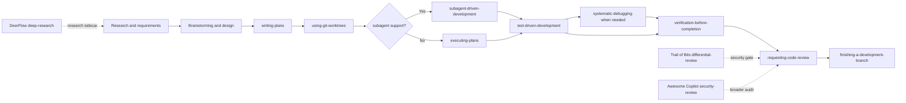
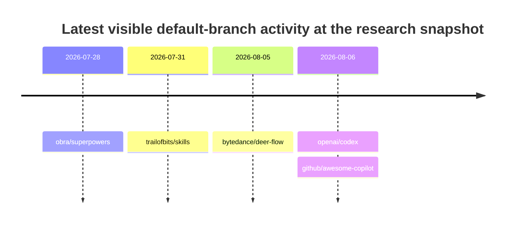
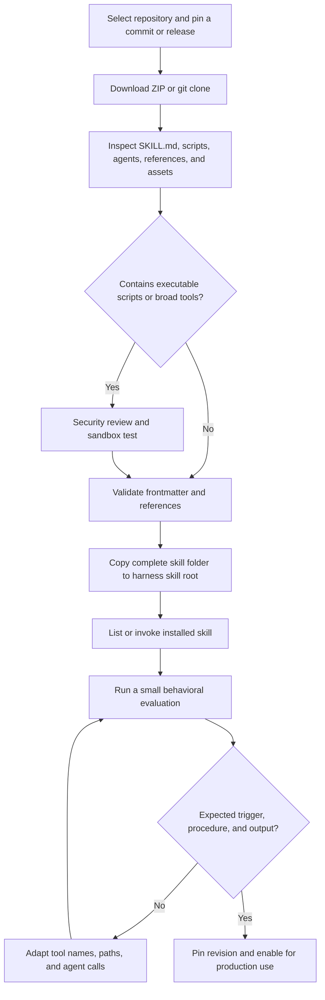
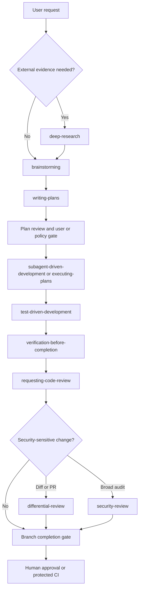

You’re right. **MCPs were not what you asked for.** I conflated “things an agent can use” with **Agent Skills—downloadable `SKILL.md` packages**. That was the wrong scope.

Here are the actual skill files/folders I should have given you.

### The install set I would use

| Function            | Skill                                              | Direct skill link                                                                                                                                                                                                                                                                                                | Why I picked it                                                                                                                                                                               |
| ------------------- | -------------------------------------------------- | ---------------------------------------------------------------------------------------------------------------------------------------------------------------------------------------------------------------------------------------------------------------------------------------------------------------- | --------------------------------------------------------------------------------------------------------------------------------------------------------------------------------------------- |
| **Orchestration**   | **Superpowers — `subagent-driven-development`**    | [Skill folder](https://github.com/obra/superpowers/tree/main/skills/subagent-driven-development?utm_source=chatgpt.com) · [Raw SKILL.md](https://raw.githubusercontent.com/obra/superpowers/main/skills/subagent-driven-development/SKILL.md?utm_source=chatgpt.com)                                             | Fresh implementer per task, isolated context, spec-review → quality-review loops, explicit failure/escalation handling. ([GitHub][1])                                                         |
| **Research**        | **ByteDance DeerFlow — `deep-research`**           | [Skill folder](https://github.com/bytedance/deer-flow/tree/main/skills/public/deep-research?utm_source=chatgpt.com) · [Raw SKILL.md](https://raw.githubusercontent.com/bytedance/deer-flow/main/skills/public/deep-research/SKILL.md?utm_source=chatgpt.com)                                                     | Actual research methodology skill: broad exploration, multi-angle investigation, source gathering and synthesis rather than one-shot search. ([GitHub][2])                                    |
| **Code review**     | **OpenAI Codex — `code-review`**                   | [Skill folder](https://github.com/openai/codex/tree/main/.codex/skills/code-review?utm_source=chatgpt.com) · [Raw SKILL.md](https://raw.githubusercontent.com/openai/codex/main/.codex/skills/code-review/SKILL.md?utm_source=chatgpt.com)                                                                       | Official OpenAI skill. It orchestrates separate review subagents and requires file/line-specific findings instead of vague review prose. ([GitHub][3])                                        |
| **Verification**    | **Superpowers — `verification-before-completion`** | [Skill folder](https://github.com/obra/superpowers/tree/main/skills/verification-before-completion?utm_source=chatgpt.com) · [Raw SKILL.md](https://raw.githubusercontent.com/obra/superpowers/main/skills/verification-before-completion/SKILL.md?utm_source=chatgpt.com)                                       | One of the strongest verification prompts I've found: requires fresh test/build/lint evidence and explicitly forbids trusting an agent's “success” report. ([GitHub][4])                      |
| **Security review** | **Trail of Bits — `differential-review`**          | [Skill folder](https://github.com/trailofbits/skills/tree/main/plugins/differential-review/skills/differential-review?utm_source=chatgpt.com) · [Raw SKILL.md](https://raw.githubusercontent.com/trailofbits/skills/main/plugins/differential-review/skills/differential-review/SKILL.md?utm_source=chatgpt.com) | This is an actual security-review skill from **Trail of Bits**. Risk-first diff review, blast-radius analysis, git-history context, test coverage and evidence-backed findings. ([GitHub][5]) |
| **Code building**   | **Superpowers — `test-driven-development`**        | [Skill folder](https://github.com/obra/superpowers/tree/main/skills/test-driven-development?utm_source=chatgpt.com) · [Raw SKILL.md](https://raw.githubusercontent.com/obra/superpowers/main/skills/test-driven-development/SKILL.md?utm_source=chatgpt.com)                                                     | RED→GREEN→REFACTOR with an explicit requirement to observe the test fail before implementation. Excellent constraint against plausible-but-untested AI code. ([GitHub][6])                    |
| **Code planning**   | **Superpowers — `writing-plans`**                  | [Skill folder](https://github.com/obra/superpowers/tree/main/skills/writing-plans?utm_source=chatgpt.com) · [Raw SKILL.md](https://raw.githubusercontent.com/obra/superpowers/main/skills/writing-plans/SKILL.md?utm_source=chatgpt.com)                                                                         | Requires file mapping, bite-sized implementation tasks, explicit tests, repository conventions, DRY/YAGNI and enough detail for a fresh agent to execute. ([GitHub][7])                       |

## Best single repository

If you want to install **one package first**, I would start with **`obra/superpowers`**:

[Superpowers repository](https://github.com/obra/superpowers?utm_source=chatgpt.com)
[Download Superpowers ZIP](https://github.com/obra/superpowers/archive/refs/heads/main.zip?utm_source=chatgpt.com)

As of the research snapshot it has roughly **255k GitHub stars**, is MIT licensed, and ships dedicated skills for brainstorming, planning, execution, parallel-agent orchestration, TDD, debugging, verification and code review. It supports Claude Code, Codex, Gemini CLI, OpenCode, Cursor and Copilot CLI. ([GitHub][8])

The particularly useful folders are:

```text
skills/
├── brainstorming/
├── writing-plans/
├── executing-plans/
├── subagent-driven-development/
├── dispatching-parallel-agents/
├── test-driven-development/
├── systematic-debugging/
├── verification-before-completion/
├── requesting-code-review/
└── finishing-a-development-branch/
```

That's almost your entire requested engineering lifecycle in one coherent suite. ([GitHub][9])

### Why I would still add three outside skills

I would **not** rely exclusively on Superpowers.

For **research**, ByteDance's `deep-research` is much more specialized than the Superpowers suite. DeerFlow itself is a large, actively used project—current search results put it around 67k+ GitHub stars—and its research skill is a standalone `SKILL.md`, so you can copy the skill without adopting DeerFlow itself. ([GitHub][2])

For **security**, I prefer Trail of Bits' `differential-review` over a generic “OWASP checklist” skill because it explicitly reasons about the **changed code**, blast radius, historical context and regression risk. That's much closer to how a good security engineer reviews a real PR. ([GitHub][5])

For **code review**, OpenAI's own Codex repository now contains an actual `code-review/SKILL.md`. It delegates individual review dimensions to subagents and aggregates every finding with concrete file/line evidence. That's exactly the sort of independent-review structure I would want around an LLM builder. ([GitHub][3])

## One security alternative worth downloading too

GitHub's **`awesome-copilot`** repository has an actual `security-review` Agent Skill:

[GitHub security-review skill folder](https://github.com/github/awesome-copilot/tree/main/skills/security-review?utm_source=chatgpt.com)
[Raw security-review SKILL.md](https://raw.githubusercontent.com/github/awesome-copilot/main/skills/security-review/SKILL.md?utm_source=chatgpt.com)

It explicitly targets SQL injection, XSS, command injection, secrets, insecure dependencies and access-control problems, and describes itself as reasoning over code/data flow rather than only pattern matching. ([GitHub][10])

I'd rank **Trail of Bits first for PR/diff security review**, GitHub's skill second for broad codebase auditing.

## Installation

These are **skills**, not MCP servers. For a harness following the Agent Skills convention, copy the **whole skill directory**, not merely `SKILL.md` when it has sibling prompt/reference files.

For Claude Code:

```bash
mkdir -p ~/.claude/skills
cp -R /downloaded/repo/skills/SKILL_NAME ~/.claude/skills/
```

For Codex, Superpowers' current skill documentation identifies the personal skills directory as:

```bash
~/.agents/skills/
```

and Claude's as:

```bash
~/.claude/skills/
```

([GitHub][11])

GitHub Copilot supports repository skills under:

```text
.github/skills/<skill-name>/SKILL.md
```

and injects the relevant `SKILL.md` into the coding agent when selected. ([GitHub Docs][12])

### The exact combination I'd load

```text
superpowers/subagent-driven-development
superpowers/dispatching-parallel-agents
superpowers/writing-plans
superpowers/test-driven-development
superpowers/verification-before-completion
superpowers/requesting-code-review

bytedance/deer-flow/deep-research
openai/codex/code-review
trailofbits/skills/differential-review
```

That is the answer I should have given you originally: **nine actual downloadable Agent Skills, with the skill files themselves linked**, not LangGraph, Tavily, Semgrep MCP, etc.

One particularly good signal for Superpowers is that the repository has started adding **behavioral tests for the skills themselves**: its code-review workflow has a test that plants SQL injection, plaintext-password handling and credential-logging defects and asserts that the reviewer catches them. That is much stronger evidence than “the prompt looks good,” although it is still not a standardized coding benchmark. ([GitHub][13])

If I reduce this to only **five** installs, I'd choose **Superpowers**, **DeerFlow deep-research**, **OpenAI code-review**, and **Trail of Bits differential-review**, with Superpowers supplying planning/building/verification/orchestration.

[1]: https://github.com/obra/superpowers/blob/main/skills/subagent-driven-development/SKILL.md?utm_source=chatgpt.com "superpowers/skills/subagent-driven-development/SKILL.md at main · obra/superpowers · GitHub"
[2]: https://github.com/bytedance/deer-flow/blob/main/skills/public/deep-research/SKILL.md?utm_source=chatgpt.com "deer-flow/skills/public/deep-research/SKILL.md at main · bytedance/deer-flow · GitHub"
[3]: https://github.com/openai/codex/blob/main/.codex/skills/code-review/SKILL.md?utm_source=chatgpt.com "codex/.codex/skills/code-review/SKILL.md at main · openai/codex · GitHub"
[4]: https://github.com/obra/superpowers/blob/main/skills/verification-before-completion/SKILL.md?utm_source=chatgpt.com "superpowers/skills/verification-before-completion/SKILL.md at main · obra/superpowers · GitHub"
[5]: https://github.com/trailofbits/skills/blob/main/plugins/differential-review/skills/differential-review/SKILL.md?utm_source=chatgpt.com "skills/plugins/differential-review/skills/differential-review/SKILL.md at main · trailofbits/skills · GitHub"
[6]: https://github.com/obra/superpowers/blob/main/skills/test-driven-development/SKILL.md?utm_source=chatgpt.com "superpowers/skills/test-driven-development/SKILL.md at main · obra/superpowers · GitHub"
[7]: https://github.com/obra/superpowers/blob/main/skills/writing-plans/SKILL.md?utm_source=chatgpt.com "superpowers/skills/writing-plans/SKILL.md at main · obra/superpowers · GitHub"
[8]: https://github.com/obra/superpowers?utm_source=chatgpt.com "GitHub - obra/superpowers: An agentic skills framework & software development methodology that works. · GitHub"
[9]: https://github.com/obra/superpowers/blob/main/README.md?utm_source=chatgpt.com "superpowers/README.md at main · obra/superpowers · GitHub"
[10]: https://github.com/github/awesome-copilot/blob/main/skills/security-review/SKILL.md?utm_source=chatgpt.com "awesome-copilot/skills/security-review/SKILL.md at main · github/awesome-copilot · GitHub"
[11]: https://github.com/obra/superpowers/blob/main/skills/writing-skills/SKILL.md?utm_source=chatgpt.com "superpowers/skills/writing-skills/SKILL.md at main · obra/superpowers · GitHub"
[12]: https://docs.github.com/en/copilot/how-tos/copilot-on-github/customize-copilot/customize-cloud-agent/add-skills?utm_source=chatgpt.com "Adding agent skills for GitHub Copilot - GitHub Docs"
[13]: https://github.com/obra/superpowers/releases?utm_source=chatgpt.com "Releases · obra/superpowers · GitHub"


# Best Downloadable Agent Skills for an AI Software-Engineering Harness

## Executive summary

**Research snapshot:** August 7, 2026. Repository statistics are point-in-time measurements and will change.

The strongest **single coherent suite** is **[obra/superpowers](https://github.com/obra/superpowers)**. It is the only evaluated package that supplies an integrated workflow across discovery, design, implementation planning, isolated execution, test-driven development, debugging, review, and final verification. Its strongest differentiator is not merely the number of prompts: the skills reference one another as an enforced development lifecycle, use independent subagents for implementation and review, and have repository-level integration and behavioral tests. Superpowers had approximately **268,000 stars and 24,000 forks** at the research snapshot, making it by far the most widely adopted repository in this comparison. citeturn1view0turn20search1turn24search0turn24search3

Superpowers does **not** fully cover specialist research or application-security review. The best practical stack therefore combines it with:

| Function | Recommended winner | Why |
|---|---|---|
| Orchestration | **Superpowers `subagent-driven-development`** | Fresh worker contexts, independent specification and quality reviews, bounded remediation loops, escalation states, and worktree isolation. |
| Research | **DeerFlow `deep-research`** | Best explicit research methodology: breadth-first exploration, multi-angle deep dives, source diversification, recency checks, and synthesis requirements. |
| General code review | **Superpowers `requesting-code-review`** | Precise diff boundaries, independent reviewer context, severity handling, and the only candidate with a directly verified planted-defect behavioral test. |
| Codex-native code review | **OpenAI Codex `code-review` bundle** | Strong fan-out orchestrator when used inside the Codex repository with all companion `code-review-*` skills; not a complete standalone skill by itself. |
| Code verification | **Superpowers `verification-before-completion`** | Converts “done” into an evidence gate requiring fresh test, build, lint, behavior, and requirement evidence. |
| Security review of a change | **Trail of Bits `differential-review`** | Risk-first diff analysis, blast-radius mapping, git-history analysis, adversarial modeling, test-gap analysis, and explicit confidence/coverage reporting. |
| Broad codebase security audit | **Awesome Copilot `security-review`** | Wider vulnerability taxonomy, cross-file data-flow analysis, secret scanning, dependency review, and structured remediation output. |
| Code building | **Superpowers `test-driven-development`** | Enforces observed red–green–refactor rather than accepting tests written after implementation. |
| Code planning | **Superpowers `writing-plans`** | Produces file-specific, independently executable, test-oriented implementation tasks for a zero-context worker. |

The recommended **minimal install set** is therefore:

1. The relevant Superpowers suite folders.
2. DeerFlow `deep-research`.
3. Trail of Bits `differential-review`.
4. Awesome Copilot `security-review`.

Add OpenAI’s `code-review` bundle when Codex is the primary harness or when you are prepared to port all of its adjacent reviewer skills and subagent semantics.

There is an important evidence limitation: **no authoritative controlled benchmark was found that compares these individual packages head-to-head on SWE-bench, security-defect recall, or real-project completion rate**. Popularity, activity, prompt structure, CI, and behavioral tests are useful signals, but they are not proof that a skill will increase coding benchmark scores. OpenAI’s own skill-evaluation guidance recommends evaluating triggering, workflow adherence, and outputs rather than judging prompts “by vibes.” SWE-bench likewise treats executable fail-to-pass and pass-to-pass tests—not agent assertions—as the success criterion. citeturn25search1turn25search9turn25search12turn25search24

## Evaluation method and evidence limits

### What was evaluated

Each candidate was evaluated across five dimensions:

| Dimension | Weight | What was examined |
|---|---:|---|
| Functional fit | 30% | Whether the workflow directly addresses the requested function rather than merely mentioning it. |
| Prompt and package design | 20% | Trigger clarity, progressive disclosure, task decomposition, explicit gates, sibling references, output contracts, and failure handling. |
| Verification evidence | 20% | Skill-specific tests, planted-defect tests, integration tests, CI validation, or reproducible evaluation guidance. |
| Portability | 15% | Conformance to the Agent Skills folder convention and reliance on harness-specific tools, agents, hooks, or metadata. |
| Maintenance and adoption | 15% | Stars, forks, recent commits, issue/PR activity, releases, and visible maintenance infrastructure. |

The resulting scores and ranks in this report are **analytical inferences**, not benchmark results published by the maintainers.

Official Agent Skills documentation from Anthropic, OpenAI, Google, GitHub, Cursor, and OpenCode converges on the same basic package model: a directory anchored by a required `SKILL.md`, with optional `scripts/`, `references/`, `assets/`, and agent definitions. The harness initially exposes compact metadata and loads the full body and supporting resources only when the skill is selected, reducing unnecessary context consumption. citeturn17search0turn17search1turn17search3turn18search0turn18search2turn19search0

This matters because the best candidates in this report are not necessarily the shortest prompts. The better-designed packages use **progressive disclosure**: the main skill defines control flow, while large checklists, templates, reviewer prompts, and deterministic scripts remain in sibling files until required. OpenAI and Gemini’s official authoring guidance explicitly recommends moving detailed references and repeatable computation out of the main skill body. citeturn17search1turn17search19turn17search33

### Best-practice baseline

The analysis uses the following software-engineering principles as its baseline:

- A coding agent’s completion claim should be supported by executable evidence. SWE-bench evaluates patches by applying them in a reproducible environment and running tests; its primary signal is whether previously failing tests now pass without regressing passing behavior. citeturn25search9turn25search12turn25search24
- Secure development should combine requirements, human review, automated analysis, testing, and remediation rather than treating any one scanner or reviewer as sufficient. NIST’s Secure Software Development Framework calls for reviewing, analyzing, and testing code, including automated checks followed by human review. citeturn25search0turn25search3turn25search15
- Security review should be risk-directed and informed by threat modeling, control flow, data flow, and application context. OWASP emphasizes that manual review can find logic and data-flow flaws missed by automated tools, while threat modeling helps reviewers prioritize high-risk components. citeturn25search2turn25search4turn25search6turn25search16
- Skills themselves require evaluation. OpenAI recommends measuring whether a skill is selected at the correct time, follows its intended procedure, and produces acceptable artifacts. citeturn17search13turn25search1

### What cannot be verified

**Cannot verify from authoritative sources:** that any reviewed skill has a published, controlled SWE-bench improvement, a statistically measured reduction in production defects, or a peer-reviewed comparison against the other candidates.

Recent research indicates that curated skill collections can improve aggregate task performance, but those results do not establish that the individual packages in this report caused the gain. A July 2026 SkillCorpus preprint reported gains of up to 7.5 percentage points from a curated retrieval-served skill corpus, while also finding coverage and harness boundaries; it did not separately benchmark Superpowers, DeerFlow, Trail of Bits, or Awesome Copilot. citeturn19academia31

Other 2026 preprints highlight a significant supply-chain concern. One reported that existing skill scanners detected only a small fraction of cross-modal malicious-skill mutations, while another found semantic manipulation could affect skill discovery and selection. These are preprints, but they reinforce the need to pin revisions, inspect instructions and scripts, and sandbox execution rather than trusting popularity alone. citeturn19academia30turn19academia33

## Single coherent suite option

### Winner: obra/superpowers

**Repository:** [obra/superpowers](https://github.com/obra/superpowers)
**Full ZIP:** [Download the complete Superpowers repository](https://github.com/obra/superpowers/archive/refs/heads/main.zip)
**License:** MIT
**Snapshot metrics:** approximately 268,057 stars, 23,962 forks, and active development through August 2026. citeturn1view0turn20search1

Superpowers is the clear suite winner because it treats software development as a connected state machine rather than a menu of unrelated prompts. The intended path is broadly:



Superpowers’ release history documents deliberate attempts to counter recurring LLM failure modes: skipping design, jumping directly to code, trusting worker self-reports, reviewing against implementation rather than requirements, working directly on the primary branch, and declaring success based on partial checks. Its current workflow mandates isolated worktrees, uses separate specification-compliance and code-quality reviews, defines worker states such as `DONE_WITH_CONCERNS`, `BLOCKED`, and `NEEDS_CONTEXT`, and falls back to `executing-plans` where subagents are unavailable. citeturn24search3

### Core suite skills and direct downloads

| Skill | Target function | Skill folder | Raw `SKILL.md` | Required or useful sibling content |
|---|---|---|---|---|
| `subagent-driven-development` | Orchestration and execution | [Folder](https://github.com/obra/superpowers/tree/main/skills/subagent-driven-development) | [Raw](https://raw.githubusercontent.com/obra/superpowers/main/skills/subagent-driven-development/SKILL.md) | Reviewer and implementer prompt files; copy the whole folder. |
| `dispatching-parallel-agents` | Parallel orchestration | [Folder](https://github.com/obra/superpowers/tree/main/skills/dispatching-parallel-agents) | [Raw](https://raw.githubusercontent.com/obra/superpowers/main/skills/dispatching-parallel-agents/SKILL.md) | Primarily the main skill file. |
| `writing-plans` | Code planning | [Folder](https://github.com/obra/superpowers/tree/main/skills/writing-plans) | [Raw](https://raw.githubusercontent.com/obra/superpowers/main/skills/writing-plans/SKILL.md) | Plan-review prompt content may be referenced; copy the folder. |
| `test-driven-development` | Code building | [Folder](https://github.com/obra/superpowers/tree/main/skills/test-driven-development) | [Raw](https://raw.githubusercontent.com/obra/superpowers/main/skills/test-driven-development/SKILL.md) | `writing-good-tests.md`; copy the folder. |
| `verification-before-completion` | Code verification | [Folder](https://github.com/obra/superpowers/tree/main/skills/verification-before-completion) | [Raw](https://raw.githubusercontent.com/obra/superpowers/main/skills/verification-before-completion/SKILL.md) | No required sibling was observed. |
| `requesting-code-review` | General code review | [Folder](https://github.com/obra/superpowers/tree/main/skills/requesting-code-review) | [Raw](https://raw.githubusercontent.com/obra/superpowers/main/skills/requesting-code-review/SKILL.md) | `code-reviewer.md`; copy the folder. |
| `brainstorming` | Requirements and design | [Folder](https://github.com/obra/superpowers/tree/main/skills/brainstorming) | [Raw](https://raw.githubusercontent.com/obra/superpowers/main/skills/brainstorming/SKILL.md) | Reviewer prompts, references, and visual-companion scripts; full folder required. |
| `executing-plans` | Non-subagent execution fallback | [Folder](https://github.com/obra/superpowers/tree/main/skills/executing-plans) | [Raw](https://raw.githubusercontent.com/obra/superpowers/main/skills/executing-plans/SKILL.md) | Works with planning, worktree, TDD, and verification skills. |
| `systematic-debugging` | Root-cause analysis | [Folder](https://github.com/obra/superpowers/tree/main/skills/systematic-debugging) | [Raw](https://raw.githubusercontent.com/obra/superpowers/main/skills/systematic-debugging/SKILL.md) | Root-cause, defense-in-depth, condition-waiting references and utility scripts. |
| `using-git-worktrees` | Isolation | [Folder](https://github.com/obra/superpowers/tree/main/skills/using-git-worktrees) | [Raw](https://raw.githubusercontent.com/obra/superpowers/main/skills/using-git-worktrees/SKILL.md) | Used as an implementation prerequisite. |
| `finishing-a-development-branch` | Completion and integration | [Folder](https://github.com/obra/superpowers/tree/main/skills/finishing-a-development-branch) | [Raw](https://raw.githubusercontent.com/obra/superpowers/main/skills/finishing-a-development-branch/SKILL.md) | Coordinates verification and branch disposition. |

The six primary skills named in the request are all real, directly downloadable Agent Skill folders. `subagent-driven-development` includes separate worker and reviewer instructions rather than asking one context to implement and approve its own work. `dispatching-parallel-agents` explicitly limits concurrency to independent work domains, avoiding parallel writes to shared state. `writing-plans` assumes the implementer has little or no prior context and therefore requires precise files, actions, tests, and small tasks. `test-driven-development` requires observing the test fail for the intended reason before writing the minimum passing implementation. citeturn5search0turn5search1turn5search2turn5search3

`verification-before-completion` is unusually forceful but operationally sound. Before any claim of success, it requires identifying the proving command, running the complete command freshly, reading the output and exit status, comparing the evidence with the claim, and only then reporting completion. It distinguishes testing from compilation, linting from building, and worker reports from actual version-control and test evidence. citeturn14search0turn14search3

`requesting-code-review` records exact base and head revisions, passes the description and requirements to a clean reviewer context, classifies feedback by severity, and requires critical and important findings to be resolved before proceeding. Its use of a fresh reviewer context reduces confirmation bias from the implementation conversation. citeturn14search1

### Effectiveness evidence

Superpowers has the strongest skill-specific evaluation evidence found in this set. Its release notes describe multiple testing frameworks and integration tests for document review, worktree enforcement, branch warnings, skill recognition, platform loading, and workflow compliance. Most importantly, the repository has a behavioral test that plants SQL injection, plaintext-password handling, and credential-logging defects and verifies that the dispatched code reviewer identifies every planted issue at critical or important severity and refuses approval. citeturn24search0turn24search3

That test does **not** establish general security-review recall, because it uses a tiny controlled project and a small defect set. It is nevertheless stronger evidence than a prompt inspection alone.

### Limitations and mitigation

Superpowers has four notable limitations.

First, it can be **process-heavy** for small or exploratory changes. Mitigate this with explicit project policy stating which workflows may be shortened, while retaining the final verification gate.

Second, subagent fan-out increases token consumption, latency, and the chance of conflicting edits. Use `dispatching-parallel-agents` only for genuinely independent tasks, cap concurrency, and require worktree or branch isolation.

Third, its prompts can be rigid. TDD is valuable for behavior that can be specified and executed, but not every documentation, infrastructure, generated-code, or spike task benefits from a literal unit-test-first cycle. Define approved alternatives such as compile checks, snapshot tests, property tests, schema validation, or disposable prototypes.

Fourth, the full suite can execute shell commands and modify a repository. Run it in a sandbox with least-privilege credentials and human approval before pushing, opening a PR, modifying CI, or accessing secrets.

**Suite assessment:** **9.1/10** as a coherent software-engineering workflow. Its main gaps are deep external research and specialist security auditing.

## Best-in-class skills by function

### Orchestration

#### Top rank: Superpowers `subagent-driven-development`

**Folder:** [subagent-driven-development](https://github.com/obra/superpowers/tree/main/skills/subagent-driven-development)
**Raw:** [SKILL.md](https://raw.githubusercontent.com/obra/superpowers/main/skills/subagent-driven-development/SKILL.md)

The skill follows a controller–worker–reviewer pattern. Each implementation task receives a fresh worker context, after which separate reviewers examine requirement compliance and code quality. Current versions use bounded re-review loops and explicit status returns rather than accepting a generic “done.” The package includes supporting reviewer and implementer prompts, so the full folder—not only `SKILL.md`—is required. citeturn5search0turn6view0turn24search3

**Why it is effective:** independent reviewer contexts reduce self-approval bias; exact task text reduces dependence on hidden conversation state; specification review before quality review distinguishes “well written” from “correctly requested”; worktrees limit cross-task contamination.

**Risk:** high operational authority if workers can write files, run commands, and commit. Require sandboxing, independent final verification, concurrency limits, and approval before remote actions.

#### Second rank: Superpowers `dispatching-parallel-agents`

**Folder:** [dispatching-parallel-agents](https://github.com/obra/superpowers/tree/main/skills/dispatching-parallel-agents)
**Raw:** [SKILL.md](https://raw.githubusercontent.com/obra/superpowers/main/skills/dispatching-parallel-agents/SKILL.md)

This is the better choice when the workload contains independent investigations rather than a sequential implementation plan. The prompt warns against parallelizing coupled tasks or allowing multiple workers to modify shared state. citeturn5search1

**Why it ranks second:** it is a valuable orchestration primitive, but not a complete build lifecycle. It needs planning, integration, verification, and review skills around it.

### Research

#### Top rank: DeerFlow `deep-research`

**Repository:** [bytedance/deer-flow](https://github.com/bytedance/deer-flow)
**Folder:** [deep-research](https://github.com/bytedance/deer-flow/tree/main/skills/public/deep-research)
**Raw:** [SKILL.md](https://raw.githubusercontent.com/bytedance/deer-flow/main/skills/public/deep-research/SKILL.md)
**Full ZIP:** [Download DeerFlow](https://github.com/bytedance/deer-flow/archive/refs/heads/main.zip)
**License:** MIT
**Snapshot metrics:** approximately 79,396 stars and 10,846 forks. citeturn1view1turn20search0

The folder contains a standalone `SKILL.md` without required sibling files. Its process begins with broad exploration, identifies separate research dimensions, performs deeper searches using multiple query formulations, fetches primary content rather than relying on snippets, follows references, checks source diversity and recency, and synthesizes only after coverage criteria are met. citeturn7view0turn7view1

The prompt’s synthesis checklist asks for multiple substantive angles, authoritative and current sourcing, and discussion of both benefits and challenges. Its temporal-query guidance is useful for avoiding the common agent mistake of treating old and current information as equivalent.

**Why it is effective:** it separates exploration from synthesis, encourages query reformulation, requires actual source fetching, and includes a coverage gate. These mechanisms address premature convergence and single-source dependence.

**Dependencies:** the original prompt expects tools named `web_search` and `web_fetch`. DeerFlow’s harness supplies those tools, as well as filesystem, shell, sandbox, and configurable skill discovery. When porting the folder, map those names to the destination harness’s search and page-fetch tools. citeturn0search10turn16search6

**Compatibility:** structurally portable because it is a conventional `SKILL.md`, but functionally dependent on live search and fetch capability. A harness without web access can load the skill but cannot execute its intended workflow.

**Testing evidence:** DeerFlow has backend unit tests, frontend unit tests, and frontend end-to-end CI. **Cannot verify from authoritative sources** that `deep-research` itself has a dedicated behavioral evaluation or a published research-quality benchmark. citeturn16search6

**Risks and mitigations:**

- Web prompt injection: treat retrieved pages as untrusted data, not instructions.
- Citation hallucination: require recorded URLs or source identifiers and verify each cited claim against fetched content.
- Secret leakage: do not expose private repository contents or credentials to external search tools.
- Research sprawl: cap search rounds and require an explicit unresolved-questions section.
- Stale information: include exact publication and event dates and prioritize authoritative primary sources.

**Assessment:** **8.7/10** for general deep research; **9.0/10** inside DeerFlow or another harness with equivalent web tooling.

### General code review

#### Top rank: Superpowers `requesting-code-review`

**Folder:** [requesting-code-review](https://github.com/obra/superpowers/tree/main/skills/requesting-code-review)
**Raw:** [SKILL.md](https://raw.githubusercontent.com/obra/superpowers/main/skills/requesting-code-review/SKILL.md)

The package combines `SKILL.md` with a reviewer prompt. It obtains exact Git revisions, supplies the change description and governing requirements, sends the review to a separate context, and forces action on severe findings. citeturn14search1

It ranks first because it has both a reasonable review design and the strongest verified package-specific test: the planted-vulnerability behavioral test described above. citeturn24search0

**Limitation:** its default reviewer is general rather than a complete language- or framework-specific reviewer. Pair it with repository checks and a specialist security skill.

#### Second rank: OpenAI Codex `code-review`

**Repository:** [openai/codex](https://github.com/openai/codex)
**Folder:** [code-review](https://github.com/openai/codex/tree/main/.codex/skills/code-review)
**Raw:** [SKILL.md](https://raw.githubusercontent.com/openai/codex/main/.codex/skills/code-review/SKILL.md)
**Full ZIP:** [Download Codex](https://github.com/openai/codex/archive/refs/heads/main.zip)
**License:** Apache-2.0
**Snapshot metrics:** approximately 104,418 stars and 15,793 forks. citeturn1view2turn20search3

This `SKILL.md` is only about 14 lines. It is deliberately an **orchestrator**, not a complete reviewer. It tells Codex to locate every adjacent `code-review-*` skill, dispatch one subagent per review dimension, use high reasoning effort, return every finding, and require each finding to contain an exact file and line number. It optionally adds a `code-reviewed` label but avoids posting comments unless asked. citeturn24search1

Verified companion examples include:

- [`code-review-context`](https://github.com/openai/codex/tree/main/.codex/skills/code-review-context), which checks bounded model-context design and flags unusually large injected fragments. citeturn14search2
- [`code-review-testing`](https://github.com/openai/codex/tree/main/.codex/skills/code-review-testing), which requires integration tests for agent-logic changes and points reviewers to Codex’s integration-test infrastructure. citeturn14search4

**Why it is effective in Codex:** specialized reviewers can examine independent dimensions without crowding one context; file-and-line requirements improve actionability; unlimited findings prevent arbitrary truncation; the orchestrator uses repository-specific expertise already present in the Codex tree.

**Critical dependency:** the raw `code-review/SKILL.md` is **not standalone**. Copying only that folder into another harness leaves it asking for `code-review-*` skills that may not exist. For a portable install, copy all adjacent `.codex/skills/code-review*` directories and adapt subagent invocation, reasoning-effort syntax, GitHub identity, and label operations.

**Testing evidence:** Codex has extensive repository-level CI and integration testing, and its current development activity is high. **Cannot verify from authoritative sources** that this particular orchestrator has a controlled behavioral test measuring defect recall. citeturn12view0turn20search14

**Assessment:** **8.5/10 in the Codex repository**, approximately **6.2/10 if copied alone**.

### Code verification

#### Top rank: Superpowers `verification-before-completion`

**Folder:** [verification-before-completion](https://github.com/obra/superpowers/tree/main/skills/verification-before-completion)
**Raw:** [SKILL.md](https://raw.githubusercontent.com/obra/superpowers/main/skills/verification-before-completion/SKILL.md)

This is the strongest pure verification skill because it defines a reusable gate rather than a generic instruction to “run tests.” It requires fresh evidence for the exact claim being made:

- test claims require a complete test run and zero relevant failures;
- build claims require a successful build, not merely a clean linter;
- bug-fix claims require reproducing and resolving the original symptom;
- regression-test claims require red–green evidence;
- delegated-work claims require inspecting the actual diff and rerunning checks;
- requirements completion requires a line-by-line requirements check, not only passing tests. citeturn14search0turn14search3

This aligns closely with executable coding benchmarks such as SWE-bench, which evaluate applied patches through tests rather than model confidence. citeturn25search9turn25search12

**Limitation:** it does not decide which project-specific commands constitute sufficient evidence. Pair it with a repository verification manifest such as:

```yaml
verification:
  format: "make format-check"
  lint: "make lint"
  typecheck: "make typecheck"
  unit: "make test-unit"
  integration: "make test-integration"
  build: "make build"
  security: "make security-check"
```

The agent should run only the commands relevant to the changed surface, while CI remains the final authoritative environment.

#### Second rank: Superpowers `test-driven-development`

TDD is a verification technique as well as a building technique, but it ranks second here because a red–green cycle does not by itself prove integration, packaging, security, or complete requirements.

### Security review

#### Top rank for diffs: Trail of Bits `differential-review`

**Repository:** [trailofbits/skills](https://github.com/trailofbits/skills)
**Plugin folder:** [differential-review plugin](https://github.com/trailofbits/skills/tree/main/plugins/differential-review)
**Skill folder:** [differential-review skill](https://github.com/trailofbits/skills/tree/main/plugins/differential-review/skills/differential-review)
**Raw:** [SKILL.md](https://raw.githubusercontent.com/trailofbits/skills/main/plugins/differential-review/skills/differential-review/SKILL.md)
**Full ZIP:** [Download Trail of Bits Skills](https://github.com/trailofbits/skills/archive/refs/heads/main.zip)
**License:** CC-BY-SA-4.0
**Snapshot metrics:** approximately 6,500 stars and 558 forks. citeturn22view0turn23view3

The skill folder contains:

```text
differential-review/
├── SKILL.md
├── methodology.md
├── adversarial.md
├── patterns.md
├── reporting.md
├── agents/
└── assets/
```

The supporting files are not optional decoration. The package separates risk methodology, adversarial reasoning, vulnerability patterns, reporting format, and worker definitions from the control prompt. Copy the complete folder or install the complete plugin. citeturn13view0turn13view1turn8view2

Its review phases cover:

1. Change identification and prioritization.
2. Git-history and intent analysis.
3. Blast-radius and affected-call-path analysis.
4. Security invariant and trust-boundary review.
5. Adversarial modeling.
6. Test and coverage-gap inspection.
7. Evidence-backed reporting with confidence and coverage limitations.

It explicitly says when it is not appropriate, including greenfield design, documentation-only changes, and purely cosmetic diffs. citeturn8view2

**Why it ranks first for changed code:** it is narrower and more security-rigorous than a generic vulnerability checklist. The risk-first design aligns with OWASP guidance to use threat context and prioritize high-risk components rather than inspect all code uniformly. citeturn25search2turn25search4

**Dependencies:** Git history and local repository access are central. The declared workflow expects file reading, search, globbing, and shell access. It integrates naturally with other Trail of Bits skills such as `audit-context-building`, `static-analysis`, `fp-check`, `property-based-testing`, and `spec-to-code-compliance`. Trail of Bits provides official marketplace installation for Claude Code and Codex, and `make check` runs most repository CI locally. citeturn22view0

**Testing evidence:** the repository has Actions, contribution checks, and a documented local validation command. **Cannot verify from authoritative sources** a dedicated differential-review benchmark with measured precision, recall, or planted-defect coverage.

**Risks and mitigations:**

- False positives: require a concrete source, sink, path, exploit precondition, and affected line for every vulnerability claim.
- Git-history anchoring: historical code may itself be wrong; treat history as context, not proof.
- Limited runtime evidence: supplement with tests, fuzzing, static analysis, and dynamic analysis.
- Sensitive findings: write reports to access-controlled storage and do not send proprietary code to external models.
- License obligations: CC-BY-SA attribution and share-alike implications should be reviewed before redistributing modified skill content.

**Assessment:** **9.0/10 for security review of a PR or commit range**.

#### Second rank and broad-audit winner: Awesome Copilot `security-review`

**Repository:** [github/awesome-copilot](https://github.com/github/awesome-copilot)
**Folder:** [security-review](https://github.com/github/awesome-copilot/tree/main/skills/security-review)
**Raw:** [SKILL.md](https://raw.githubusercontent.com/github/awesome-copilot/main/skills/security-review/SKILL.md)
**Full ZIP:** [Download Awesome Copilot](https://github.com/github/awesome-copilot/archive/refs/heads/main.zip)
**License:** MIT
**Snapshot metrics:** approximately 37,500 stars and 4,700 forks. citeturn23view0turn22view1

The folder contains `SKILL.md` and five reference documents:

```text
security-review/
├── SKILL.md
└── references/
    ├── language-patterns.md
    ├── report-format.md
    ├── secret-patterns.md
    ├── vuln-categories.md
    └── vulnerable-packages.md
```

The workflow scopes the target, audits dependencies and secrets, examines vulnerability categories, traces data across files, self-verifies findings, assigns severity, and produces a structured report. It may propose patches but says not to apply them automatically. citeturn8view3turn13view2turn2search10

**Why it is valuable:** its wider scope is better for a repository audit than a diff-only workflow. The reference separation is also good progressive-disclosure design.

**Why it ranks below Trail of Bits for PR security:** broad category coverage can become checklist-driven, while Trail of Bits places more emphasis on change intent, blast radius, attack paths, and evidence. The Awesome Copilot package also relies partly on a curated vulnerable-package reference, which can age.

**Mitigation:** never treat `vulnerable-packages.md` as a live vulnerability database. Run the ecosystem’s current advisory tools—such as the package manager’s audit command, GitHub dependency review, OSV-based tooling, or an approved enterprise scanner—and use the skill to reason about the results.

Awesome Copilot is actively maintained and has Actions and repository validation, but its README explicitly states that customizations come from third-party developers and should be inspected before installation. **Cannot verify from authoritative sources** a skill-specific behavioral test for `security-review`. citeturn22view1

**Assessment:** **8.4/10 for broad repository review**, **7.7/10 for focused PR review**.

### Code building

#### Top rank: Superpowers `test-driven-development`

**Folder:** [test-driven-development](https://github.com/obra/superpowers/tree/main/skills/test-driven-development)
**Raw:** [SKILL.md](https://raw.githubusercontent.com/obra/superpowers/main/skills/test-driven-development/SKILL.md)

The skill’s defining mechanism is not simply “write tests.” It requires:

1. Write a test for one behavior.
2. Run it and observe a meaningful failure.
3. Write the minimum implementation.
4. Run the test and observe it pass.
5. Run the broader relevant suite.
6. Refactor while preserving green tests.

The sibling testing guidance addresses test quality and common agent anti-patterns. citeturn5search3turn6view1turn24search3

**Why it is effective for LLM coding:** agents frequently generate implementation and tests from the same mistaken assumption, producing tests that pass without detecting the intended regression. Requiring the initial test to fail for the correct reason provides evidence that the test can distinguish the broken state.

**Limitation:** observed red–green is necessary but not sufficient. Generated tests may encode the wrong requirement, overmock dependencies, or miss integration behavior. Pair TDD with plan/spec review, real integration tests, and `verification-before-completion`.

**Assessment:** **8.8/10** as a build discipline.

### Code planning

#### Top rank: Superpowers `writing-plans`

**Folder:** [writing-plans](https://github.com/obra/superpowers/tree/main/skills/writing-plans)
**Raw:** [SKILL.md](https://raw.githubusercontent.com/obra/superpowers/main/skills/writing-plans/SKILL.md)

The skill instructs the planner to behave as though the implementing agent has little context. Plans identify exact files, break work into small independently testable tasks, specify tests and verification, encourage frequent commits, and apply YAGNI and DRY constraints. Newer Superpowers versions add plan-review loops that check specification alignment, decomposition, file structure, and excessive file size. citeturn5search2turn24search3

**Why it is effective:** it reduces hidden-state dependency and makes tasks dispatchable to fresh workers. A plan that says “update the service layer” is not safely delegable; a plan that names the file, relevant symbol, expected behavior, test file, failure mode, and proving command is.

**Limitation:** exact file plans can become stale after the first task changes architecture. Require the controller to revalidate later task paths and assumptions before dispatch.

**Assessment:** **9.0/10**, or **9.3/10** when preceded by Superpowers `brainstorming` and followed by plan review.

## Comparative scorecard and rankings

### Repository and package comparison

The table uses repository-wide adoption and CI signals because GitHub does not expose separate star counts for individual skill folders. “Behavioral test” means a verified skill-behavior test, not merely linting or repository unit tests. “Risk” is an inference about the authority and data exposure normally required by the skill.

| Skill | Function | Repository | Raw `SKILL.md` | License | Stars / forks | Latest visible default-branch activity | Tests or CI | Verified behavioral test | Supported harnesses | Operational risk |
|---|---|---|---|---|---:|---|---|---|---|---|
| `subagent-driven-development` | Orchestration | obra/superpowers | [Raw](https://raw.githubusercontent.com/obra/superpowers/main/skills/subagent-driven-development/SKILL.md) | MIT | 268.1k / 24.0k | Jul. 28, 2026 visible commit page; API showed a later Aug. 6 push | Extensive integration and platform tests | Workflow tests; no standalone benchmark | Claude, Codex, Cursor, Copilot CLI, OpenCode; reduced Gemini mode | High |
| `dispatching-parallel-agents` | Orchestration | obra/superpowers | [Raw](https://raw.githubusercontent.com/obra/superpowers/main/skills/dispatching-parallel-agents/SKILL.md) | MIT | 268.1k / 24.0k | Same repository | Same repository suite | No isolated performance benchmark verified | Same as above; requires subagents for full behavior | High |
| `writing-plans` | Planning | obra/superpowers | [Raw](https://raw.githubusercontent.com/obra/superpowers/main/skills/writing-plans/SKILL.md) | MIT | 268.1k / 24.0k | Same repository | Document-review and integration tests | Plan-review workflow tests | Broad, with reviewer adaptation where needed | Medium |
| `test-driven-development` | Building | obra/superpowers | [Raw](https://raw.githubusercontent.com/obra/superpowers/main/skills/test-driven-development/SKILL.md) | MIT | 268.1k / 24.0k | Same repository | Suite integration tests | No controlled coding benchmark verified | Broad where shell/test execution exists | Medium-high |
| `verification-before-completion` | Verification | obra/superpowers | [Raw](https://raw.githubusercontent.com/obra/superpowers/main/skills/verification-before-completion/SKILL.md) | MIT | 268.1k / 24.0k | Same repository | Suite tests | Workflow-level evidence gates | Broad where commands can be run | Medium |
| `requesting-code-review` | Code review | obra/superpowers | [Raw](https://raw.githubusercontent.com/obra/superpowers/main/skills/requesting-code-review/SKILL.md) | MIT | 268.1k / 24.0k | Same repository | Suite tests | **Yes: planted SQLi/password/logging defects** | Best with subagent-capable harnesses | Medium-high |
| `deep-research` | Research | bytedance/deer-flow | [Raw](https://raw.githubusercontent.com/bytedance/deer-flow/main/skills/public/deep-research/SKILL.md) | MIT | 79.4k / 10.8k | Aug. 5, 2026 | Backend, frontend, and E2E CI | None verified for this skill | Portable with search/fetch tool mapping | Medium-high |
| `code-review` bundle | Code review | openai/codex | [Raw](https://raw.githubusercontent.com/openai/codex/main/.codex/skills/code-review/SKILL.md) | Apache-2.0 | 104.4k / 15.8k | Aug. 6, 2026 | Extensive Codex CI/integration tests | None verified for the orchestrator | Codex native; partial elsewhere after porting companions | Medium-high |
| `differential-review` | Security diff review | trailofbits/skills | [Raw](https://raw.githubusercontent.com/trailofbits/skills/main/plugins/differential-review/skills/differential-review/SKILL.md) | CC-BY-SA-4.0 | 6.5k / 558 | Jul. 31, 2026 | Actions and `make check` | None with published recall verified | Claude and Codex officially; portable with adaptations | High |
| `security-review` | Broad security audit | github/awesome-copilot | [Raw](https://raw.githubusercontent.com/github/awesome-copilot/main/skills/security-review/SKILL.md) | MIT | 37.5k / 4.7k | Aug. 6, 2026 | Actions, schemas, repository validation | None verified for this skill | Copilot native; standard folder portable elsewhere | Medium-high |

Repository statistics and activity dates come from GitHub repository metadata and commit pages. Superpowers’ API showed an August 6 repository push even though the latest default-branch commit page visible to the crawler was dated July 28; that discrepancy is why both are stated rather than silently treating one as the other. citeturn1view0turn1view1turn1view2turn11view0turn11view1turn12view0turn23view1turn23view2turn23view3turn23view0



The timeline shows that all five repositories were recently maintained; recency therefore does not distinguish them as strongly as package completeness, behavioral testing, and functional specialization. citeturn11view0turn11view1turn12view0turn23view1turn23view2

### Per-function ranking

| Function | Rank | Candidate | Analytical score | Rationale |
|---|---:|---|---:|---|
| Orchestration | 1 | Superpowers `subagent-driven-development` | 9.3 | Complete controller/worker/reviewer cycle, context isolation, escalation, and review loops. |
|  | 2 | Superpowers `dispatching-parallel-agents` | 8.4 | Excellent parallel primitive, but requires external planning and integration. |
| Research | 1 | DeerFlow `deep-research` | 8.7 | Strongest research-specific procedure and temporal/source-diversity guidance. |
|  | 2 | Superpowers `brainstorming` | 6.8 | Strong product/design discovery, but not an external evidence-research workflow. |
| Code review | 1 | Superpowers `requesting-code-review` | 8.9 | Clean reviewer context, exact diff, severity policy, and a planted-defect behavioral test. |
|  | 2 | OpenAI Codex `code-review` bundle | 8.5 in Codex | Excellent specialist fan-out, but depends on companion skills and Codex semantics. |
|  | 3 | Trail of Bits `differential-review` | 8.2 | Stronger for security than general maintainability or product correctness. |
| Verification | 1 | Superpowers `verification-before-completion` | 9.2 | Best explicit evidence gate and claim-to-command mapping. |
|  | 2 | Superpowers `test-driven-development` | 8.4 | Strong red–green evidence, but does not cover all completion dimensions. |
| Security review | 1 | Trail of Bits `differential-review` | 9.0 | Best risk-first and change-focused security analysis. |
|  | 2 | Awesome Copilot `security-review` | 8.4 | Best broader repository scan, but more checklist-oriented and partly static. |
|  | 3 | Superpowers `requesting-code-review` | 7.2 | Demonstrated ability to catch planted security defects, but not security-specialist. |
| Building | 1 | Superpowers `test-driven-development` | 8.8 | Strong observed red–green discipline and test-quality references. |
|  | 2 | Superpowers `subagent-driven-development` | 8.6 | Strong implementation control, but building quality depends on the task and tests. |
| Planning | 1 | Superpowers `writing-plans` | 9.0 | Best zero-context, file-specific, test-oriented task decomposition. |
|  | 2 | Superpowers `brainstorming` + `writing-plans` | 9.3 combined | Strongest end-to-end design-to-plan combination, though it is two skills. |

## Compatibility, installation, and architecture

### Harness compatibility

A standard skill folder is broadly portable, but **syntactic portability is not the same as behavioral portability**. A harness may successfully discover `SKILL.md` while lacking the subagent, web-search, shell, hook, or reviewer primitives assumed by its instructions.

| Harness | Official Agent Skills support | Practical notes for these packages |
|---|---|---|
| Claude Code | Yes; follows the open standard and adds invocation, subagent, and dynamic-context extensions | Best native fit for Superpowers and Trail of Bits. |
| Codex CLI/App | Yes; global `~/.agents/skills`, repository `.agents/skills` | Best fit for OpenAI `code-review`; Superpowers and Trail of Bits also publish Codex installation support. |
| GitHub Copilot CLI/cloud/code review | Yes | Best native fit for Awesome Copilot; repository skills live with the project and can influence Copilot code review. |
| Gemini CLI | Yes; supports install, link, list, and activation | Standard folders work, but Superpowers documents that Gemini lacked the required subagent behavior for its full subagent-driven mode and therefore uses an execution fallback. |
| OpenCode | Yes; native on-demand skill tool | Discovers OpenCode, Claude-compatible, and `.agents` skill locations. |
| Cursor | Yes; official Agent Skills support | Standard folders are supported; Superpowers also offers plugin installation. |

Official documentation confirms progressive-disclosure skill loading in Claude Code and Codex, native Agent Skills support in Gemini CLI, Copilot, Cursor, and OpenCode, and repository/global skill scopes in several harnesses. citeturn17search0turn17search1turn17search3turn17search15turn17search37turn18search0turn18search2turn19search0

### Standard manual installation

Always copy the **entire skill directory** when sibling files are present.



#### Claude Code

```bash
mkdir -p ~/.claude/skills
cp -R /path/to/repository/path/to/skill ~/.claude/skills/
```

Claude Code follows the open Agent Skills standard and can run selected skills in the current conversation or in isolated subagent contexts. citeturn17search0turn17search4turn17search8

For Superpowers, the maintained installation is preferable to manual copying:

```text
/plugin install superpowers@claude-plugins-official
```

For Trail of Bits:

```text
/plugin marketplace add trailofbits/skills
/plugin install trailofbits/skills/plugins/differential-review
```

Trail of Bits’ repository documents its marketplace flow and Codex compatibility. citeturn22view0turn13view0

#### Codex

Global:

```bash
mkdir -p ~/.agents/skills
cp -R /path/to/skill ~/.agents/skills/
```

Repository-scoped:

```bash
mkdir -p .agents/skills
cp -R /path/to/skill .agents/skills/
```

Codex’s official customization documentation identifies `~/.agents/skills` and `.agents/skills` as the global and repository roots. citeturn17search37

For Trail of Bits:

```bash
codex plugin marketplace add trailofbits/skills
codex plugin list
codex plugin add differential-review@trailofbits
```

For OpenAI’s repository-specific code review bundle, copy **all required `code-review-*` directories**, not only `.codex/skills/code-review`.

#### GitHub Copilot

Repository installation follows the repository skill scope:

```text
.github/
└── skills/
    └── security-review/
        ├── SKILL.md
        └── references/
```

GitHub documents that skills work with Copilot’s cloud agent, code review, CLI, app, and supported IDE agent modes. Review-focused names and descriptions make Copilot code review more likely to load the skill. citeturn18search0turn18search6turn18search18

For Awesome Copilot, the official CLI-based install is:

```bash
gh skills install github/awesome-copilot security-review
```

The GitHub documentation cited in the repository requires a sufficiently recent GitHub CLI for `gh skills`; copying the folder manually remains a valid alternative. citeturn2search10

#### Gemini CLI

Install a repository:

```bash
gemini skills install https://github.com/OWNER/REPOSITORY
```

Or link a local skill during development:

```bash
gemini skills link /absolute/path/to/skill
gemini skills list
```

Gemini CLI’s official documentation supports installation from Git, a local path, or a packaged skill, and uses `.gemini/skills/<name>/SKILL.md` in project examples. citeturn17search7turn17search15turn17search35

#### OpenCode

Project scope:

```text
.opencode/skills/<skill-name>/SKILL.md
```

Global scope:

```text
~/.config/opencode/skills/<skill-name>/SKILL.md
```

OpenCode also searches Claude-compatible and `.agents/skills` locations, which can allow one shared installation to serve multiple harnesses. citeturn19search0turn19search9

#### Cursor

Cursor officially supports the Agent Skills open standard. For Superpowers, the project provides a direct plugin command:

```text
/add-plugin superpowers
```

For other packages, use Cursor’s current Skills installation interface or the folder scope documented by the installed Cursor version, then verify discovery in the agent before relying on automatic invocation. citeturn18search2turn18search17turn20search1

### Portable sparse installation

GitHub does not provide an official first-party ZIP download for an arbitrary repository subtree. The safest primary-source options are either the full repository ZIP or a sparse Git checkout.

Example for DeerFlow `deep-research`:

```bash
set -euo pipefail

tmpdir="$(mktemp -d)"
trap 'rm -rf "$tmpdir"' EXIT

git clone \
  --depth=1 \
  --filter=blob:none \
  --sparse \
  https://github.com/bytedance/deer-flow.git \
  "$tmpdir/deer-flow"

git -C "$tmpdir/deer-flow" sparse-checkout set \
  skills/public/deep-research

mkdir -p ~/.agents/skills/deep-research
cp -R \
  "$tmpdir/deer-flow/skills/public/deep-research/." \
  ~/.agents/skills/deep-research/

test -f ~/.agents/skills/deep-research/SKILL.md
```

Equivalent sparse paths:

```text
obra/superpowers:
  skills/subagent-driven-development
  skills/dispatching-parallel-agents
  skills/writing-plans
  skills/test-driven-development
  skills/verification-before-completion
  skills/requesting-code-review

openai/codex:
  .codex/skills/code-review
  .codex/skills/code-review-*

trailofbits/skills:
  plugins/differential-review

github/awesome-copilot:
  skills/security-review
```

### Post-install verification

A skill should not be considered successfully installed merely because its file exists. Verify:

```bash
find "$SKILL_ROOT" -maxdepth 3 -name SKILL.md -print
```

Then check that:

1. YAML frontmatter contains a unique `name` and a clear task-triggering `description`.
2. Every relative sibling-file reference resolves.
3. Executable scripts have been inspected and are limited to required permissions.
4. The harness lists or discovers the skill.
5. An explicit invocation follows the expected procedure.
6. An unrelated prompt does not spuriously invoke the skill.
7. A representative task produces the required artifacts and verification evidence.

This follows OpenAI’s recommendation to evaluate skill triggering, procedure, and output rather than only the prose of the skill. citeturn17search13turn25search1

## Recommended install sets and risk controls

### Minimal install set

The minimal set covers every requested function while minimizing overlap.

#### Superpowers engineering core

Install these folders:

```text
skills/brainstorming
skills/writing-plans
skills/using-git-worktrees
skills/subagent-driven-development
skills/dispatching-parallel-agents
skills/executing-plans
skills/test-driven-development
skills/systematic-debugging
skills/verification-before-completion
skills/requesting-code-review
skills/finishing-a-development-branch
```

**ZIP:** [obra/superpowers main ZIP](https://github.com/obra/superpowers/archive/refs/heads/main.zip)

This supplies planning, orchestration, building, debugging, general review, verification, and completion.

#### DeerFlow deep research

Install:

```text
skills/public/deep-research
```

**ZIP:** [bytedance/deer-flow main ZIP](https://github.com/bytedance/deer-flow/archive/refs/heads/main.zip)

Map `web_search` and `web_fetch` to your harness before enabling automatic invocation.

#### Trail of Bits differential review

Install the complete plugin:

```text
plugins/differential-review
```

**ZIP:** [trailofbits/skills main ZIP](https://github.com/trailofbits/skills/archive/refs/heads/main.zip)

Use it as the mandatory security gate for nontrivial PRs, authentication and authorization changes, parsers, deserialization, cryptography, shell execution, CI workflows, and trust-boundary changes.

#### Awesome Copilot security review

Install:

```text
skills/security-review
```

**ZIP:** [github/awesome-copilot main ZIP](https://github.com/github/awesome-copilot/archive/refs/heads/main.zip)

Use it for scheduled whole-repository audits and broad vulnerability-category review, not as a substitute for live dependency and secret scanners.

### Expanded install set

The expanded set adds specialist validation and Codex-native review.

| Repository ZIP | Additional folders | Purpose |
|---|---|---|
| [Superpowers ZIP](https://github.com/obra/superpowers/archive/refs/heads/main.zip) | `receiving-code-review`, `writing-skills`, all reviewer prompts and platform references | Better feedback handling, skill maintenance, and complete suite integration. |
| [DeerFlow ZIP](https://github.com/bytedance/deer-flow/archive/refs/heads/main.zip) | Other public research skills after individual inspection | Domain-specific research workflows where present. |
| [OpenAI Codex ZIP](https://github.com/openai/codex/archive/refs/heads/main.zip) | All `.codex/skills/code-review*` directories | Codex-native multidimensional PR review. |
| [Trail of Bits ZIP](https://github.com/trailofbits/skills/archive/refs/heads/main.zip) | `audit-context-building`, `static-analysis`, `fp-check`, `property-based-testing`, `spec-to-code-compliance`, language-specific review skills | Deeper context, tool-assisted findings, false-positive review, invariant testing, and specification verification. |
| [Awesome Copilot ZIP](https://github.com/github/awesome-copilot/archive/refs/heads/main.zip) | Only individually reviewed skills relevant to the project stack | Additional Copilot-oriented workflows without loading the entire collection indiscriminately. |

Trail of Bits’ marketplace lists dedicated skills for context building, static analysis, false-positive checks, property-based testing, specification compliance, C/C++ review, Rust review, insecure defaults, supply-chain analysis, and variant analysis. These are preferable to asking one very broad security prompt to perform every specialty. citeturn22view0

### Recommended execution policy

A robust harness should not allow the skills to call one another arbitrarily. Use a controlled lifecycle:



Recommended mandatory gates are:

- No implementation before an accepted design and plan for substantial changes.
- No worker may approve its own work.
- No completion claim without a fresh command and captured result.
- No security finding without a concrete path, affected location, reasoning, and confidence.
- No remote push, merge, release, dependency update, or secret access without policy approval.
- No security-sensitive merge solely on an LLM review; retain human and automated review.

### Security controls for skill supply chains

A production harness should treat a downloaded skill as executable supply-chain content, even when it contains only Markdown. Its instructions can cause an agent to read files, run commands, select other skills, or disclose information.

Use the following controls:

| Threat | Required mitigation |
|---|---|
| Malicious or compromised skill update | Pin a commit SHA or signed release; review diffs before upgrading; retain a known-good lockfile of skill revisions. |
| Hidden behavior in scripts or assets | Review every executable and referenced file, not only `SKILL.md`; prohibit downloads and network calls unless explicitly required. |
| Semantic prompt injection | Treat skill instructions as code subject to review; reject instructions that override system policy, request unrelated secrets, or hide actions from the user. |
| Secret exfiltration | Run without cloud credentials by default; mount only necessary files; redact environment variables; block outbound network access for coding and review skills. |
| Destructive shell actions | Use a container or disposable worktree; deny writes outside the project; require approval for deletion, package publishing, Git remotes, and CI changes. |
| Hallucinated code-review findings | Require exact file and line, execution or data-flow reasoning, confidence, and a reproduction or validating test where possible. |
| False completion | Enforce `verification-before-completion` at the controller level, not as an optional worker instruction. |
| Stale security references | Use live vulnerability, secret, dependency, SAST, and policy tools; treat bundled reference lists as heuristics. |
| Excessive agent fan-out | Set concurrency, token, elapsed-time, and remediation-round limits; cancel redundant workers. |
| License contamination | Record each package’s license and attribution; review CC-BY-SA obligations before modifying and redistributing Trail of Bits content. |

NIST recommends combining code review, automated analysis, checklists, testing, and human remediation. OWASP similarly treats manual code review as complementary to—not replaced by—automated security tools. citeturn25search0turn25search4turn25search14

### Final recommendation

For a harness intended to perform serious software-engineering work, install:

```text
Primary lifecycle:
  obra/superpowers
    brainstorming
    writing-plans
    using-git-worktrees
    subagent-driven-development
    dispatching-parallel-agents
    executing-plans
    test-driven-development
    systematic-debugging
    verification-before-completion
    requesting-code-review
    finishing-a-development-branch

Research:
  bytedance/deer-flow
    skills/public/deep-research

Security:
  trailofbits/skills
    plugins/differential-review

  github/awesome-copilot
    skills/security-review
```

For a Codex-centered deployment, add:

```text
openai/codex
  .codex/skills/code-review
  .codex/skills/code-review-*
```

The primary decision is therefore not “one suite or separate skills.” The best architecture is **one coherent engineering suite plus specialist research and security skills**. Superpowers provides the development control plane; DeerFlow provides evidence-gathering discipline; Trail of Bits provides change-centered adversarial review; Awesome Copilot supplies broader repository coverage; and OpenAI’s code-review bundle is a strong optional Codex-native review fan-out.
