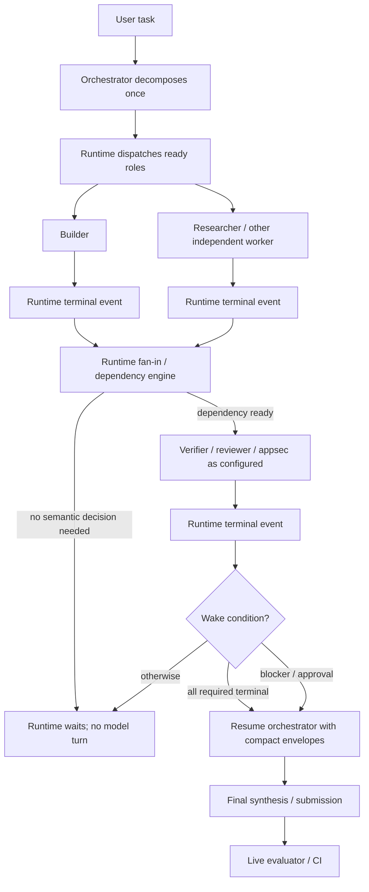

# Reducing Expensive Orchestrator Work in Orchestra: Practical Control-Plane, Handoff, Testing, and Runtime Policies

## Executive summary

- **Corrected thesis:** Orchestra should not optimize for the fewest aggregate tokens or the fewest subagents. Its near-term objective should be to **maximize displacement of expensive orchestrator tokens into bounded, cheaper/local subagent execution while preserving evaluator quality**. This is already consistent with Orchestra's current R005 positioning: the public research index says default delegation is useful because per-microtask dispatch reasoning tends to under-delegate, and identifies local-model routing, narrow scope, compact returns, timeouts, concurrency limits, and artifact-backed details as the cost-control mechanisms. citeturn21view0turn21view1

- **The most important architectural change is to take waiting, lifecycle bookkeeping, and routine routing out of the model loop.** The orchestrator should never call `orch_status`, sleep, tail logs, run `ps`, inspect Git merely to detect completion, or otherwise poll. Claude Code already delivers background-subagent results as later completion notifications; LangGraph checkpoints asynchronous tasks and resumes from persisted state; Microsoft Agent Framework can pause for external events without consuming model tokens; CrewAI and Google ADK both expose event-driven/deterministic workflow primitives. Orchestra should make this behavior a runtime guarantee rather than a prompt suggestion. citeturn20view1turn19view3turn19view4turn22view1turn19view7turn19view9

- **The orchestrator should also stop being a coding/testing shadow worker while subagents are active.** Its default responsibilities should be decomposition, dispatch, approvals that genuinely require high-capability judgment, exception handling, terminal synthesis, and user interaction. Implementation, repository exploration, debugging, test output, and detailed review belong in isolated subagent contexts. Claude Code explicitly recommends subagents for tests, logs, searches, and other high-output work because only the relevant summary returns to the main context. AutoGen similarly moved tool execution directly into agents so the group-chat manager no longer has to route tool calls. citeturn20view4turn20view2turn19view5

- **Compact returns should be typed envelopes pointing to artifacts, not prose reports.** OpenAI's Agents SDK supports strict JSON-schema outputs and validation; CrewAI exposes JSON/Pydantic task outputs; LangGraph requires serializable task results for checkpointing. For Orchestra, the model-visible envelope can usually be reduced to `status`, a one-sentence `summary` or `blocker`, and a `result_ptr`; test evidence, diffs, criteria-by-criteria verification, logs, and detailed findings should remain in an artifact. citeturn22view3turn22view2turn19view4

- **Duplicate dispatch should be prevented by the runtime, not by asking the orchestrator to remember what it already launched.** A dispatch ledger keyed by role + normalized scope + success contract + input/base revision should coalesce an identical active dispatch, reuse an unchanged completed result, and resume/retry a failed run explicitly. Claude Code's `resume` mechanism retains the prior subagent's history rather than starting over; LangGraph checkpoints completed work so it need not be recomputed; a retained Claude-Code-style BenchAgent trace even used an artifact existence check to `SKIP` already-produced output. citeturn20view2turn19view4turn18view1

- **The strict default test policy should be: builder owns the ordinary implementation test loop; verifier must not repeat an unchanged builder command merely to gain confidence; reviewer and appsec do not rerun generic functional tests; orchestrator runs no tests; final evaluator/CI is the authoritative live check.** A verifier may run *different* checks that cover unverified criteria, adversarial cases, or a genuinely independent concern. This exact role split is a proposed Orchestra policy rather than an externally established optimum, but it is consistent with mini-SWE-agent putting reproduce/fix/verify/edge-case testing inside the coding agent, Claude Code recommending a test-running subagent to isolate verbose output, and SWE-bench using a separate deterministic test harness as final adjudicator. citeturn18view4turn20view2turn18view3

- **Verifier overclaim should be fixed structurally rather than by making the orchestrator suspicious.** A verifier should not emit free-form `PASS`. Required criteria should be machine-typed as `pass | fail | inconclusive`, with evidence pointers; a criterion requiring execution cannot become `pass` unless runtime-recorded execution evidence exists. The orchestrator trusts that structured result for the verifier's assigned scope, while a live evaluator/CI remains the independent source of final task correctness. Strict structured-output validation is directly supported by OpenAI and CrewAI; SWE-bench demonstrates the value of separating agent output from deterministic external grading. citeturn22view3turn22view2turn18view3

- **Benchmark the proposed changes as control-plane ablations, not as "fewer agents versus more agents."** Orchestra should preserve the normal strong-dispatch configuration while measuring expensive orchestrator input/output tokens, orchestrator API/tool calls, duplicate-command executions, duplicate-dispatch count, model-visible polling turns, bytes/tokens returned into the orchestrator, evaluator pass rate, wall time, and critical-path time. OrchBench's July 2026 results are especially relevant: task-critical information preservation was more important than raw agent count, and its controlled ablations showed omitted transfers and lossy context transfer were major determinants of orchestration quality. citeturn16academia29turn18view2


## Corrected thesis and assessment of the prior recommendations

### Verified facts

The public Orchestra repository already describes essentially the right economic objective. Orchestra says its strongest use case is a high-capability remote/frontier main session delegating bounded work to cheaper/local models, and its R005 research record explicitly says that **default delegation remains useful** because evaluating each prospective microtask separately tends to under-delegate once cumulative main-context cost is considered. It also calls out compact results and artifact-backed detail as cost-control mechanisms. citeturn21view0turn21view1

That distinction matters for the user's benchmark data. Using the figures supplied in the prompt, Batch04's 7.57 million main tokens for the three cap-easy tasks is about **8.17×** the no-Orchestra 0.926 million baseline, despite being about **31.2% lower** than Batch03's 11.0 million. The remaining optimization target is therefore not "make the workers cheaper by using them less"; it is "stop the expensive orchestrator from reproducing work that has already been pushed to cheaper workers." Those figures are user-supplied orchestra-bench observations rather than independently verifiable public benchmark results.

Anthropic provides a useful warning against conflating multi-agent quality scaling with token efficiency. Its research system reported that multi-agent workflows consumed substantially more tokens than ordinary chats, while still improving performance by exploiting independent context windows and parallel research. Anthropic also cautioned that coding often has fewer truly parallelizable subtasks than research. For Orchestra, that evidence argues for **cheap worker-token abundance plus expensive-orchestrator restraint**, not for treating total token count as the primary objective. citeturn15view0

The strongest generalizable architectural signal across frameworks is that **procedural coordination belongs in code whenever the decision is procedural**. OpenAI says code-based orchestration is more deterministic and predictable in speed, cost, and performance; Google's workflow agents execute sequential/parallel/loop structures without consulting a model; CrewAI Flows provide event-driven procedural control around crews; Microsoft provides deterministic durable multi-agent orchestrations; LangGraph makes tasks asynchronous/checkpointed workflow units. citeturn15view3turn19view7turn19view9turn22view1turn19view4

### Agree / disagree with the previous direction

| Prior idea | Assessment after refinement | Reason |
|---|---|---|
| Keep the frontier orchestrator focused on planning/judgment/synthesis | **Strongly agree** | This matches Orchestra's stated architecture and Claude Code's context-isolation pattern. citeturn21view2turn20view4 |
| Route bounded work to cheap/local roles | **Strongly agree** | This is Orchestra's principal cost proposition; Claude Code also explicitly supports cheaper subagent models. citeturn21view0turn20view3 |
| Compact typed handoffs | **Strongly agree; make stricter** | Make the model-visible response an envelope plus an artifact pointer, rather than a mini-report. Structured JSON/Pydantic outputs are established framework primitives. citeturn22view3turn22view2 |
| Artifact-backed context manifests | **Agree; promote to a first-class protocol** | Orchestra's existing research proposes precisely this direction, and Chain-of-Agents shows that forwarding accumulated task-critical information instead of full prior contexts can handle long inputs effectively. citeturn15view1turn15view5 |
| Risk/selectivity should decide whether ordinary roles are dispatched | **Disagree as a near-term Orchestra optimization** | It conflicts with the product goal and with R005's current argument for default delegation. Selectivity may remain a later experimental axis but should not be mixed into the immediate main-token optimization. citeturn21view0 |
| Orchestrator should independently confirm worker findings | **Disagree** | It recreates the expensive context/work that isolation was intended to remove. Quality should instead come from role ownership, structured evidence, verifier boundaries, and an external evaluator. Claude Code explicitly keeps subagent tool work outside the main conversation. citeturn20view0turn20view2 |
| Orchestrator may keep coding/debugging/testing while workers run | **Disagree as the strict `/orch on` default** | Background execution should free the orchestrator context, not invite a duplicate implementation path. Claude Code completion notifications and durable/event-driven runtimes provide better control-plane patterns. citeturn20view1turn22view1 |
| Periodic `orch_status`/sleep/history polling | **Strongly disagree** | Runtime eventing can perform waiting without model-visible turns. Anthropic specifically shows event callbacks and completion notifications; Microsoft explicitly supports waits that consume no model tokens. citeturn19view1turn20view1turn22view1 |
| Repeated verification by builder, verifier, reviewer, appsec, orchestrator | **Disagree** | External systems support specialized scopes and independent final evaluators, but there is no strong evidence that repeating identical commands across roles improves coding quality enough to justify the cost. The proposed non-duplication rule therefore requires Orchestra ablation testing. citeturn18view4turn18view3 |

The **corrected thesis** is therefore:

> **Orchestra should preserve strong default subagent dispatch while turning the expensive orchestrator into a sparse, event-driven semantic control layer. Deterministic runtime code owns lifecycle, waiting, deduplication, dependency release, status, evidence bookkeeping, and routine fan-in. Subagents own repository work and detailed verification within explicit scopes. The orchestrator sees compact typed terminal results and wakes only when a high-level decision, blocker, approval, or final synthesis actually requires the expensive model.**

That thesis is an inference from the combined framework evidence rather than a quoted recommendation from any one vendor. It is particularly supported by Orchestra's R005 positioning, OpenAI's deterministic code-orchestration guidance, Claude Code's isolated subagent contexts/completion notifications, Microsoft's token-free durable waits, and Google's model-free workflow execution. citeturn21view0turn15view3turn20view4turn20view1turn22view1turn19view7


## Evidence from frameworks and recent benchmarks

The table emphasizes mechanisms that map directly to the observed Orchestra pathologies rather than giving a general survey.

| Source | Relevant evidence | Implication for Orchestra |
|---|---|---|
| [Orchestra R005 research index](https://github.com/lunarnexus/orchestra/tree/main/docs/research) | R005 says the strongest cost case is frontier-main → local/cheap bounded work, and explicitly retains default delegation while emphasizing narrow scope, compact returns, timeouts, concurrency, and artifact-backed details. citeturn21view0 | Treat **expensive orchestrator tokens** as the primary cost metric. Do not solve Batch04 by merely dispatching less. |
| [Orchestra README](https://github.com/lunarnexus/orchestra) | Orchestra already defines the main role as planning/judgment/approvals/synthesis while subagents own evidence, implementation, and checks; it also promises compact summaries with full artifacts preserved. citeturn21view1turn21view2 | Make those role boundaries enforceable runtime/prompt policy rather than descriptive guidance. |
| [Anthropic multi-agent research system](https://www.anthropic.com/engineering/multi-agent-research-system) | Separate subagent contexts increase available reasoning capacity, but Anthropic reports substantially higher aggregate token consumption and notes coding is less parallel than research. citeturn15view0 | Cheap worker tokens can reasonably increase; avoid judging Orchestra by total tokens alone. Keep orchestrator fan-in compact. |
| [Claude Code subagents](https://code.claude.com/docs/en/sub-agents) | Claude Code says to use subagents when searches/logs/files would flood the main conversation; work occurs in an independent context and only a summary/final result returns. It specifically gives test-suite execution as a context-isolation use case. citeturn20view4turn20view2 | Tests, logs, repository exploration, debugging, and detailed review belong off the orchestrator context. |
| [Claude Code background subagents](https://code.claude.com/docs/en/sub-agents) | A finished background subagent reaches Claude through a later **completion notification**, and Claude waits for that notification rather than needing to discover completion itself. citeturn20view1 | Make worker completion a runtime event. Eliminate model-visible `orch_status`/sleep loops. |
| [Claude Agent SDK hooks](https://code.claude.com/docs/en/agent-sdk/hooks) | Hooks run on events including subagent start/stop, idle, tool use, and execution finish. citeturn19view1 | Maintain status, timing, evidence metadata, and wakeups in callback code outside the expensive model. |
| [Anthropic: code execution with MCP](https://www.anthropic.com/engineering/code-execution-with-mcp) | Anthropic shows that processing/filtering intermediate data before returning it to the model cuts context load, and argues ordinary code loops/conditionals are more context-efficient than alternating tool calls through the agent loop. citeturn19view2 | `sleep → status → history → status` is exactly the kind of control flow that should be compiled into runtime code. Filter status/results before model visibility. |
| [OpenAI Agents SDK orchestration](https://openai.github.io/openai-agents-python/multi_agent/) | OpenAI distinguishes bounded specialists from user-facing managers and says code orchestration is more deterministic/predictable for speed, cost, and performance; parallel agents can be launched with ordinary async primitives. citeturn15view3 | Move role sequencing, fan-out/fan-in, dedup, dependency checks, and completion barriers into the Orchestra runtime. |
| [OpenAI Agents SDK structured output](https://openai.github.io/openai-agents-python/ref/agent_output/) | Agent output can be constrained by JSON schema and validated; strict JSON mode is explicitly recommended in the SDK implementation. citeturn22view3 | Replace free-form "PASS"/reports with a small validated return envelope. |
| [LangGraph Functional API](https://docs.langchain.com/oss/python/langgraph/functional-api) | Tasks are asynchronous; results are checkpointed; task outputs are serializable; completed results can be restored rather than recomputed after resumption. citeturn19view4 | Treat dispatched work as futures/checkpointed task records, not conversations the orchestrator repeatedly interrogates. |
| [LangGraph interrupts](https://docs.langchain.com/oss/python/langgraph/interrupts) | Graph execution can persist state and wait indefinitely until an external resume; event streaming surfaces the state change. citeturn19view3 | Blocked/approval states should suspend the workflow and wake the orchestrator only when an event requiring it exists. |
| [Microsoft Agent Framework Durable Extension](https://learn.microsoft.com/en-us/agent-framework/hosting/azure-functions) | Durable workflows checkpoint progress, avoid repeating completed work, and can pause for external events **without consuming compute or model tokens while waiting**. citeturn22view1 | This is the clearest external precedent for Orchestra's desired "orchestrator NEVER polls" rule. |
| [Microsoft AutoGen migration guidance](https://microsoft.github.io/autogen/0.4.8/user-guide/agentchat-user-guide/migration-guide.html) | AutoGen v0.4 moved tool execution into the individual `AssistantAgent`; its group-chat manager no longer has to route tool calls. citeturn19view5 | Avoid orchestrator mediation of implementation/test tool use. Workers should interact with their tools directly. |
| [AutoGen termination](https://microsoft.github.io/autogen/stable/user-guide/agentchat-user-guide/tutorial/termination.html) | Termination checks consume the **delta** of new agent events/messages rather than requiring repeated full-history processing, and token/time/message conditions can be code-level termination conditions. citeturn19view6 | Orchestra's control plane should process state transitions/deltas, never replay history into the orchestrator. |
| [CrewAI Flows](https://docs.crewai.com/v1.15.6/en/guides/flows/first-flow) | Flows provide structured, event-driven procedural control and can respond to completion events while maintaining workflow state. citeturn19view9 | A deterministic Flow-like shell around strongly dispatched roles is preferable to model-controlled lifecycle bookkeeping. |
| [CrewAI task outputs](https://docs.crewai.com/v1.15.14/en/concepts/tasks) | Task results can be raw, JSON, or typed Pydantic outputs rather than unconstrained prose. citeturn22view2 | Use a tiny typed model-visible result and retain full content in an artifact. |
| [Google ADK workflow agents](https://adk.dev/agents/workflow-agents/) | Sequential/parallel/loop workflows execute predefined logic **without asking an AI model to orchestrate the sequence**. citeturn19view7 | Ordinary role sequencing and fan-in should not spend orchestrator tokens. |
| [Google ADK state](https://adk.dev/sessions/state/) | ADK distinguishes compact mutable `session.state` from the complete `session.events` history. citeturn22view4 | `orch_status` should expose a compact projection of state, not a history dump. |
| [Google Chain-of-Agents](https://research.google/blog/chain-of-agents-large-language-models-collaborating-on-long-context-tasks/) | Workers process segmented context and pass accumulated useful information onward; the final manager receives accumulated evidence rather than the entire original long context. Google reported gains of up to 10% over tested baselines. citeturn15view5 | Context should be partitioned and handed off as task-critical facts/artifacts, not copied conversation history. |
| [mini-SWE-agent local-model workflow](https://mini-swe-agent.com/latest/models/local_models/) | Its recommended coding workflow has the coding agent reproduce the issue, edit, rerun the reproduction, and test edge cases before submission. It also truncates overly long command output to head/tail. citeturn18view4 | Builder-owned test loops and output compression have direct coding-agent precedent. |
| [SWE-bench evaluation guide](https://www.swebench.com/SWE-bench/guides/evaluation/) | SWE-bench adjudicates a submitted patch by applying it and executing tests in a controlled Docker environment. citeturn18view3 | Separate worker evidence from the final external correctness authority; the orchestrator need not act as that authority. |
| [OrchBench paper](https://arxiv.org/abs/2607.25656) | OrchBench reports simulated orchestration metrics correlated with real Claude Code execution (`r=0.816`) while using a fraction of execution resources; importantly, task-critical information preservation dominated raw agent count in its experiments. citeturn16academia29turn18view2 | Benchmark handoff information retention and duplicate context explicitly, rather than equating orchestration quality with dispatch count. |
| [BenchAgent paper](https://arxiv.org/html/2606.05670v1) | Controlled fixed-MAS variants often spent more without commensurate gains, while retained Claude-Code-style traces showed runtime-created roles, artifact writing, verifier-stage control, and explicit team events. Debate-like extra coordination expanded token usage without proportionate GAIA error correction in the reported comparison. citeturn17search0turn18view1 | Preserve strong cheap dispatch, but eliminate conversational coordination loops. Extra *worker execution* and extra *orchestrator coordination* should be treated as different costs. |

A particularly useful negative example is Magentic-One-style repeated model-level coordination. Microsoft describes a progress ledger that is repeatedly updated to determine progress and the next speaker. That design is reasonable where the coordinator itself is part of the reasoning engine, but it is a poor default for Orchestra's stated economics when the coordinator is the expensive frontier session. In Orchestra, the equivalent task ledger should be runtime state and should reach the orchestrator only when it contains an exception or terminal synthesis input. citeturn11search3turn11search6turn22view1


## Implementable Orchestra policy changes

The following policies deliberately **preserve strong subagent dispatch volume**. They target unnecessary work in the expensive session.

### Parent/manager behavior → orchestrator behavior

**Policy A — the orchestrator is a semantic control plane, not a shadow executor.**

After initial decomposition and dispatch, the orchestrator MUST NOT, for an active worker-owned scope:

- open or reread implementation files merely to follow progress;
- run Git/status/diff commands merely to see what the builder changed;
- reproduce or debug an issue assigned to the builder;
- execute tests assigned to builder/verifier;
- tail worker logs;
- query process state;
- call `orch_status`, `orch_history`, or equivalent polling operations;
- independently redo review/appsec work;
- start a second implementation path unless the workflow explicitly calls for independent parallel solutions.

This is a **proposed policy**, supported indirectly by Claude Code's recommendation to isolate high-output work in subagents, AutoGen's movement of tool execution out of the manager, and deterministic code-orchestration guidance from OpenAI and Google. citeturn20view2turn19view5turn15view3turn19view7

The orchestrator MAY wake for only five semantic reasons:

`decision_required`, `approval_required`, `blocker`, `terminal_fan_in`, or `user_event`.

Timeout/liveness detection itself is runtime work. A timeout should become a model-visible event only when deterministic retry/resume/cancellation policy cannot resolve it. Microsoft's durable runtime is particularly strong evidence that external-event waiting can occur without spending model tokens. citeturn22view1

A practical prompt-level rule is:

```text
ACTIVE-WORKER DISCIPLINE

When a dispatched subagent owns a scope, do not inspect, implement, debug,
test, review, poll, or monitor that scope yourself.

End the model turn after all currently-ready dispatches are submitted.
The runtime will resume you only for:
- a blocker requiring judgment,
- an approval,
- a terminal fan-in,
- an unrecoverable timeout/failure,
- or new user input.

Treat structured terminal subagent results as authoritative for their
assigned scope. Do not rerun their work merely to confirm it.
```

The runtime should enforce as much of this as possible. Prompting alone will inevitably leak.

### Test ownership

**Policy B — one ordinary test owner per command/scope/revision.**

The strict default should be:

| Actor | Default responsibility | May execute tests? |
|---|---|---|
| **Builder** | Reproduce → implement → run targeted regression/relevant test suite → record evidence | **Yes; primary owner** |
| **Verifier** | Evaluate success criteria from builder artifact; identify missing coverage; optionally run *distinct* criteria-specific/adversarial checks | **Yes, but not a verbatim rerun by default** |
| **Reviewer** | Code/design correctness, maintainability, API/schema/concurrency concerns from diff/artifacts | **No generic functional rerun** |
| **Appsec** | Security-specific analysis/checks within security scope | **Security-specific only** |
| **Orchestrator** | Coordination and synthesis | **No** |
| **Final evaluator / CI** | Independent authoritative end-to-end adjudication | **Yes** |

The external evidence does **not** prove that this exact split is globally optimal. What is verified is that successful coding agents such as mini-SWE-agent place iterative tests inside the implementation agent; Claude Code recommends offloading test execution because its output can consume large context; and SWE-bench places final correctness testing in an external harness. The finer rule—"verifier runs only distinct checks"—is an Orchestra-specific inference designed to remove the exact duplicate-command pathology seen in Batch04 and should be validated by ablation. citeturn18view4turn20view2turn18view3

A command becomes eligible for rerun only when its evidence has been **invalidated**, for example because the code revision changed after the result, the environment changed materially, the previous command was incomplete, or the final independent evaluator intentionally performs its own clean-room run. That invalidation rule should be runtime metadata, not orchestrator judgment.

### Verifier, reviewer, and appsec

**Policy C — specialists return scoped determinations, not prose confidence.**

A verifier should consume:

```text
builder result artifact
+ success-criteria artifact
+ relevant changed-file/diff pointer
```

It should not require the orchestrator to restate the implementation trajectory. Claude Code's isolated contexts, typed outputs in OpenAI/CrewAI, and Chain-of-Agents' propagation of useful accumulated information all support this kind of bounded transfer. citeturn20view4turn22view3turn22view2turn15view5

For each required criterion, the verifier artifact should use:

```json
{
  "id": "upload_passes",
  "status": "pass",
  "evidence_ref": "evidence/commands/cmd-007.json"
}
```

Allowed statuses:

```text
pass
fail
inconclusive
not_applicable
```

A runtime validator, not the orchestrator, should enforce:

```text
criterion requiring executable evidence
    + status == pass
    => referenced evidence exists
    => command finished
    => result satisfies the declared predicate
```

A verifier that did not execute or receive evidence sufficient to establish a required criterion must emit `inconclusive`, never a conversational approximation such as "passes with minor findings." OpenAI's strict output validation demonstrates that schema validation itself can be removed from model judgment; SWE-bench demonstrates the separate principle that final evaluator output can supersede an agent's own assessment. citeturn22view3turn18view3

Crucially, this does **not** mean the orchestrator distrusts the verifier. It means the verifier's contract makes its result well-defined enough to trust without reopening its trajectory.

### Duplicate dispatch prevention

**Policy D — dispatches are idempotent work requests.**

Introduce a runtime `dispatch_key`:

```text
SHA256(
    workflow_id
    || role
    || normalized_scope
    || success_contract_version
    || input_artifact_digest
    || base_revision
)
```

The proposed behavior:

```text
same key + ACTIVE
    -> return existing run handle

same key + SUCCESS and inputs/revision unchanged
    -> return cached terminal envelope/result_ptr

same key + FAILED/TIMEOUT and resumable
    -> resume existing worker state

same key + FAILED/TIMEOUT and non-resumable
    -> create retry generation with explicit retry_reason

different scope / changed inputs / changed revision
    -> new dispatch_key, new work is allowed
```

This is the **dispatch deduplication rule** Orchestra needs.

Claude Code provides direct precedent for resuming the same subagent while retaining its previous history rather than spawning a fresh one. LangGraph checkpoints task results so completed work does not have to be recomputed. Microsoft durable workflows similarly checkpoint completed executor/agent steps so they are not repeated after failure or restart. citeturn20view2turn19view4turn22view1

The BenchAgent-retained Claude Code workflow offers a small but illustrative artifact-level idempotency pattern: its Writer was told to check whether the output file already existed and skip creation when it did. citeturn18view1

An intentional redundant second verifier is still possible, but it must use an explicit distinct purpose such as:

```text
redundancy_mode = independent_second_opinion
```

and therefore a different dispatch key. A second identical `verifier(scope=X)` should never arise merely because the orchestrator forgot that one already exists.

### Status, waiting, and polling

**Policy E — `orch_status` becomes a human/debugging projection of runtime state, not an orchestrator workflow primitive.**

The model-facing workflow MUST NOT rely on `orch_status`. Runtime callbacks update the store when state changes; the CLI/UI may read the store as often as humans need. Claude SDK hooks provide lifecycle callbacks for subagent start/stop and execution completion; Google ADK separates compact state from full event history; AutoGen termination operates on message deltas instead of replaying whole histories. citeturn19view1turn22view4turn19view6

The normal compact status record should contain only:

```json
{
  "run_id": "r_01J...",
  "role": "builder",
  "task": "fix upload validation",
  "scope": "uploads endpoint + tests",
  "status": "running",
  "age_s": 184,
  "blocker": null,
  "result_ptr": null
}
```

For a terminal run:

```json
{
  "run_id": "r_01J...",
  "role": "builder",
  "task": "fix upload validation",
  "scope": "uploads endpoint + tests",
  "status": "success",
  "age_s": 411,
  "blocker": null,
  "result_ptr": ".orchestra/runs/r_01J.../result.json"
}
```

The path shown here is a **proposed Orchestra path**, not an assertion about the current repository layout.

Normal `orch_status` should **not** include prompts, conversation transcripts, command output, token-by-token events, complete history, full diffs, full test output, or reasoning. Those should require explicitly separate diagnostic interfaces. ADK's state-versus-events distinction and Anthropic's filtering of large intermediate tool results provide direct precedents for such separation. citeturn22view4turn19view2

### Worker-return compression

**Policy F — terminal messages are indexes into artifacts.**

Claude Code warns that many detailed subagent results can themselves consume the main context, even though the subagent trajectories remain isolated. citeturn20view4

Therefore place a hard semantic—not merely character—budget on model-visible returns. A worker should return:

```text
terminal state
+ one-sentence semantic result
+ result artifact pointer
```

Everything else is lazy-loadable.

The orchestrator should not automatically load the artifact after receiving it. It loads details only when a high-level decision cannot be made from the envelope.


## Compact returns, artifact-first handoff, and event-driven waiting

### Minimal terminal return schemas

There is no authoritative external source establishing a universal minimum schema for coding subagents. The following is therefore an **inferred Orchestra design**, grounded in OpenAI/CrewAI typed-output support, Claude Code's summary-only context isolation, and LangGraph's serializable task-result model. citeturn22view3turn22view2turn20view4turn19view4

**Successful completion**

```json
{
  "status": "success",
  "summary": "Implemented upload validation; assigned builder checks passed.",
  "result_ptr": ".orchestra/runs/r123/result.json"
}
```

That is sufficient for most orchestrator fan-in. The pointed-to artifact contains files, commands, criteria, logs, and detailed findings.

**Blocked / failed**

```json
{
  "status": "blocked",
  "blocker": "Required database fixture cannot be created with available permissions.",
  "result_ptr": ".orchestra/runs/r124/result.json"
}
```

The runtime already knows the role/run/scope, so repeating them in the model-visible return wastes tokens.

**Incomplete / timeout**

```json
{
  "status": "incomplete",
  "reason": "timeout",
  "result_ptr": ".orchestra/runs/r125/result.json",
  "resume_id": "agent_7f..."
}
```

`resume_id` is only necessary if the runtime cannot derive it from `run_id`. Prefer omitting it when runtime state already maps the run to a resumable worker. Claude Code's resume mechanism shows why preserving prior worker state is preferable to issuing a new full-context assignment after an interruption. citeturn20view2

A useful design test is: **could the orchestrator decide what happens next without opening the artifact?** If yes, no more text belongs in the envelope.

### Artifact-first dispatch

Orchestra's own earlier research already proposed a context manifest containing goal, scope, required facts, selected artifacts, explicitly excluded context, success criteria, and budgets. That is directionally strong; the refinement is to make the manifest itself the primary dispatch payload rather than serializing those fields into the model-visible orchestrator conversation and then restating them to every worker. citeturn15view1

A proposed immutable task artifact:

```json
{
  "schema": "orchestra.task/v1",
  "task_id": "task-upload-validation",
  "objective": "Fix upload validation to satisfy the benchmark criteria.",
  "scope": {
    "paths": [
      "src/uploads/**",
      "tests/uploads/**"
    ],
    "exclude": [
      "unrelated application modules"
    ]
  },
  "criteria": [
    {
      "id": "upload_passes",
      "requirement": "Valid upload succeeds."
    },
    {
      "id": "invalid_upload_rejected",
      "requirement": "Invalid upload returns the expected rejection."
    }
  ],
  "inputs": [
    {
      "kind": "fact",
      "id": "F17",
      "value": "Upload handler is registered in ...",
      "source_ptr": "artifacts/context/F17.json"
    }
  ],
  "upstream_results": [
    ".orchestra/runs/planner-123/result.json"
  ],
  "test_contract": {
    "owner": "builder",
    "required_checks": [
      "reproduction",
      "targeted regression"
    ]
  },
  "base_revision": "abc123"
}
```

The proposed dispatch prompt then shrinks to something like:

```text
Role: builder
Task artifact: .orchestra/tasks/task-upload-validation.json
Result path: .orchestra/runs/r123/result.json

Execute only the assigned scope. Follow the role contract.
Return the standard terminal envelope.
```

The **artifact should contain** objective, precise scope, success criteria, immutable task-critical facts, provenance, selected upstream results, base revision, test ownership, and explicit exclusions.

The **dispatch prompt should contain only** role identity, artifact location, output location, and any genuinely ephemeral instruction that cannot safely be represented in the task artifact.

The **artifact should not contain** the entire user conversation, orchestrator reasoning, unrelated repository research, every previous worker transcript, complete logs from upstream workers, or generic role instructions. Role instructions belong in versioned role definitions; details belong behind artifact pointers.

This is consistent with Claude Code fresh subagents not receiving the main conversation history by default, with Google Chain-of-Agents forwarding useful accumulated information rather than every previous source token, and with ADK's separation of compact session state from full event history. citeturn20view4turn15view5turn22view4

### Artifact result format

The result artifact can be richer because it does **not** enter the orchestrator context automatically:

```json
{
  "schema": "orchestra.result/v1",
  "status": "success",
  "summary": "Implemented upload validation.",
  "base_revision": "abc123",
  "result_revision": "def456",
  "changed_files": [
    "src/uploads/handler.py",
    "tests/uploads/test_handler.py"
  ],
  "criteria": [
    {
      "id": "upload_passes",
      "status": "pass",
      "evidence_ref": "evidence/cmd-03.json"
    },
    {
      "id": "invalid_upload_rejected",
      "status": "pass",
      "evidence_ref": "evidence/cmd-04.json"
    }
  ],
  "commands": [
    {
      "id": "cmd-03",
      "argv_digest": "sha256:...",
      "exit_code": 0,
      "log_ptr": "logs/cmd-03.txt"
    }
  ],
  "findings": [],
  "blockers": []
}
```

The runtime can use these fields for deduplication, evidence validation, command-duplicate metrics, and test invalidation without placing the artifact into an LLM context.

### Event-driven wait behavior

The desired runtime behavior should look like this:



The crucial property is that the edge marked "wait" contains **no LLM interaction**. Claude Code already gives background workers completion notifications; Microsoft explicitly supports external-event waits without model tokens; LangGraph persists paused state; CrewAI Flows and ADK workflows provide event/procedural execution. citeturn20view1turn22view1turn19view3turn19view9turn19view7

The proposed wake policy is:

```text
wake orchestrator when ANY:
  USER_EVENT
  APPROVAL_REQUIRED
  UNRESOLVED_BLOCKER
  UNRECOVERABLE_TIMEOUT
  REQUIRED_TERMINAL_FAN_IN
```

Do **not** wake it for:

```text
worker started
worker heartbeat
worker still running
ordinary worker completed while downstream work can start deterministically
worker wrote a file
test command started
test command finished
reviewer became ready
retry/resume within deterministic policy
```

Those transitions may all be useful observability events, but they should be consumed by runtime code.

A further optimization is **event coalescing**. When several required workers finish close together, do not generate three expensive model turns. Hold terminal envelopes behind the declared fan-in barrier and inject one compact event:

```json
{
  "event": "fan_in_complete",
  "results": [
    {"role":"builder","status":"success","result_ptr":"..."},
    {"role":"verifier","status":"success","result_ptr":"..."},
    {"role":"reviewer","status":"success","result_ptr":"..."}
  ]
}
```

That particular coalescing strategy is an inference, but it follows naturally from async fan-in patterns in OpenAI, deterministic parallel workflow constructs in Google ADK, and checkpointed asynchronous tasks in LangGraph. citeturn15view3turn19view7turn19view4


## Test placement, long-running work, and quality control

### Strict default policy for test placement

The strongest implementable default for the next orchestra-bench experiments is:

> **The builder is the sole owner of the ordinary implementation test loop. The verifier consumes builder evidence and may execute only missing, distinct, or adversarial checks. Reviewer and appsec do not rerun the builder's generic functional suite. The orchestrator executes no tests. Final evaluator/CI runs the independent authoritative validation.**

This avoids the Batch04 pattern where the exact same `pytest` command was reportedly run by orchestrator, builder, verifier, reviewer, and appsec.

The builder's artifact should capture command identity, code/base revision, exit code, and log path. A verifier considering a command first queries the evidence ledger in code:

```text
has_valid_evidence(
    command_digest,
    result_revision,
    environment_digest
)
```

If valid evidence exists, the command is not executed again merely for reassurance.

The verifier can still add value through **coverage differentiation**:

```text
Builder:
    reproduction
    targeted changed-area regression
    ordinary relevant suite

Verifier:
    unchecked acceptance criterion
    adversarial boundary case
    cross-component integration criterion
    evidence consistency

Reviewer:
    semantic/code inspection

Appsec:
    security-specific checks

Evaluator/CI:
    clean independent final suite
```

The distinction between verifier evidence review and verifier distinct execution should itself be benchmarked. There is insufficient authoritative evidence to claim one is always superior. Anthropic has explicitly described specialized QA/testing agents as an area needing further exploration in its long-running-agent work, so a strong causal claim here would exceed the evidence. citeturn6view2

### Preventing overclaim without orchestrator retesting

The Public Upload, TS Approval Queue, and URL Shortener failures supplied by the user show a **calibration/interface problem**: a worker-level natural-language `PASS` is too unconstrained to serve as a correctness protocol.

The remedy is not:

```text
Verifier says pass
    -> expensive orchestrator doubts it
    -> orchestrator reads files
    -> orchestrator reruns tests
```

It should instead be:

```text
Verifier evaluates assigned criteria
    -> typed criteria artifact
    -> runtime validates evidence references
    -> orchestrator trusts terminal scoped result
    -> independent evaluator/CI finally adjudicates task
```

OpenAI's Agents SDK validates model JSON against a declared output type and raises an error for invalid output; CrewAI supports typed Pydantic/JSON task outputs. Those mechanisms establish the feasibility of enforcing return shape outside the orchestrator model. citeturn22view3turn22view2

For an execution-dependent criterion, Orchestra can further make `pass` mechanically impossible without an evidence object. That is an **Orchestra-specific inference** rather than a vendor recommendation, but it directly removes the failure mode in which "PASS" is semantically detached from what was actually executed.

The final live evaluator should remain independent. SWE-bench illustrates the clean architectural separation: the agent produces a patch; a containerized harness later applies it and runs repository tests to determine whether the issue is resolved. citeturn18view3

### Long-running task strategy

For long tasks, context partitioning becomes even more valuable. Anthropic's long-running harnesses use durable artifacts such as progress files and Git state to preserve continuity across sessions, while Claude Code keeps subagent transcripts separate and can resume a subagent with its prior context. Google Chain-of-Agents demonstrates a broader information-processing principle: workers can consume segmented contexts and propagate only useful accumulated evidence forward. citeturn6view2turn20view2turn15view5

For Orchestra, that suggests five concrete long-horizon rules:

**Partition by ownership, not by conversational turn.** A worker should own a bounded artifact/scope through local debugging and recovery rather than bouncing each small failure back to the orchestrator.

**Keep recovery local.** If a builder test fails, the builder continues debugging within its cheap context. The failure becomes orchestrator-visible only when the worker exhausts its local budget or finds a blocker requiring cross-scope judgment. This is an inference from isolated worker execution and durable/checkpointed task models. citeturn20view4turn19view4turn22view1

**Persist semantic state outside conversation.** Store revisions, scope, completed criteria, blockers, evidence, and result pointers in runtime state/artifacts. ADK's state/events split and Microsoft's durable checkpointing both support this architecture. citeturn22view4turn22view1

**Advance the dependency graph in code.** When builder completion makes verifier ready, the runtime should dispatch the verifier automatically. It should not wake the orchestrator merely to ask, "Should I now launch the verifier?" Google and OpenAI both support deterministic/code-based composition for this class of workflow transition. citeturn19view7turn15view3

**Minimize critical-path semantic fan-ins.** Wake the expensive orchestrator only where its model capability changes the decision. Independent background work should run concurrently, and downstream deterministic steps should launch immediately on required events. OpenAI explicitly recommends ordinary async parallelism for independent agents; LangGraph tasks are designed for asynchronous concurrency. citeturn15view3turn19view4


## Benchmark design and priority experiments

The existing `orchestration_value_benchmarks.md` already argues for separating quality, token ratio, cost, wall time, reliability, and variance and proposes instrumentation for token counts, context bytes, checks by role, and related workflow quantities. The next benchmark phase should narrow those measurements around the newly observed main-session pathology. citeturn15view1turn4view4turn4view5

### Primary metrics

The **headline metric** should be:

\[
\text{Expensive-orchestrator token ratio}
=
\frac{\text{Orchestra orchestrator tokens}}
     {\text{no-Orchestra main-session tokens}}
\]

Track input, output, reasoning, cached, and total orchestrator tokens independently where the harness exposes them. The target should be to drive this ratio substantially downward without sacrificing evaluator pass rate.

Also track:

| Metric | Why it matters |
|---|---|
| **Orchestrator input tokens** | Detects worker return/history/context injection bloat. |
| **Orchestrator output/reasoning tokens** | Detects repeated planning, monitoring, and duplicate debugging. |
| **Orchestrator tool/API call count** | Batch04 examples suggest extremely high parent-side call volume; this exposes whether the control loop actually became sparse. |
| **Model-visible polling calls** | `orch_status`, sleep, history, `ps`, test-tail, Git-for-monitoring. Desired default: **zero**. |
| **Worker return tokens entering orchestrator** | Directly validates return compression. |
| **Artifact bytes written/read by role** | Separates cheap artifact storage from costly model-context ingestion. |
| **Duplicate command count** | Same normalized command + compatible revision/environment executed by >1 role. |
| **Duplicate test command count** | More specific coding-workflow indicator. |
| **Duplicate dispatch count** | Same dedup key spawned more than once. Desired accidental value: **zero**. |
| **Test executions by role** | Determines whether test ownership policy is actually obeyed. |
| **Evaluator pass rate** | Primary quality guardrail. |
| **Verifier/evaluator disagreement rate** | Measures calibration/overclaim independently of orchestrator behavior. |
| **Wall time** | Guardrail against excessive serialization. |
| **Critical-path worker time** | Distinguishes useful worker computation from coordination delay. |
| **Time worker-ready → dispatch** | Tests deterministic dependency release. |
| **Terminal worker → orchestrator wake latency** | Validates event delivery without polling. |
| **Orchestrator active turns while workers running** | Under strict discipline, should approach zero except user/approval/blocker events. |
| **Context duplication bytes/tokens** | Detects repeated task/history/artifact hydration across workers. |
| **Resume vs fresh-retry rate** | Detects unnecessary redispatch after worker interruption. |

OrchBench reinforces the importance of instrumenting information transfer rather than raw agent counts: its controlled experiments found cross-agent transfer coverage and context-compression behavior strongly affected final quality. citeturn18view2turn16academia29

### Test-placement ablation

Hold **dispatch topology, models, task set, role prompts except test permissions, and evaluator** fixed. Compare:

| Variant | Builder | Verifier | Orchestrator |
|---|---|---|---|
| **Builder-only execution** | Runs normal checks | Evidence review only | No tests |
| **Builder + distinct verifier** | Runs normal checks | May run only new/distinct checks | No tests |
| **Builder + verifier evidence-only** | Runs normal checks | No execution; criteria/evidence audit | No tests |
| **Legacy duplicated testing** | Runs checks | May rerun same checks | Existing behavior, for control |

Reviewer/appsec generic functional reruns should be disabled in the three proposed variants.

For each variant report:

```text
orchestrator tokens
orchestrator tool calls
total/local-worker tokens
duplicate test commands
all test commands
evaluator pass rate
verifier/evaluator disagreement
wall time
critical-path time
```

Do **not** choose a winner from total token count alone. A variant that spends an additional one million cheap local-worker tokens but removes several million frontier-orchestrator tokens can be economically preferable under Orchestra's deployment assumptions. That weighting is a product requirement supplied by the user and is also consistent with R005's public positioning. citeturn21view0

### Return-compression ablation

Compare identical workflows with:

```text
free-form worker report
vs
structured detailed JSON returned inline
vs
3-field envelope + detailed artifact
```

Measure expensive input tokens at every subsequent orchestrator turn. Claude Code's own documentation warns that many detailed subagent results can eventually consume significant main context even when the internal trajectories are isolated, making this a particularly important ablation. citeturn20view4

### Waiting/control-plane ablation

Compare current behavior against strict runtime-owned eventing:

```text
Current:
dispatch
-> orch_status
-> sleep
-> status/history
-> git/ps/tail
-> model turn
-> repeat

Proposed:
dispatch
-> model turn ends
-> runtime awaits futures/events
-> runtime advances deterministic dependencies
-> one terminal/blocker/approval fan-in event
-> orchestrator resumes
```

The success criterion should be **zero model-visible polling operations**, not merely a lower polling rate. Claude Code's completion notification and Microsoft's zero-model-token external-event waiting show this is technically realistic, not an aspirational abstraction. citeturn20view1turn22view1

### Deduplication ablation

Inject situations analogous to the reported duplicate verifier/reviewer/appsec dispatches and assert:

```text
two identical concurrent dispatch requests
    -> one worker run

identical request after successful completion, same base/input digest
    -> cached result

retry after timeout
    -> resume/retry generation, not accidental second independent run

same role but changed scope/revision
    -> legitimate new worker run
```

Measure actual worker count, expensive orchestrator turns triggered, and result quality. LangGraph and Microsoft durable workflow semantics establish strong precedent for resuming from persisted/checkpointed completed work rather than recomputing it. citeturn19view4turn22view1

### Recommended order of implementation

The highest-confidence ordering, without touching default dispatch volume, is:

**First:** runtime-owned completion events and strict no-poll waiting.

**Second:** orchestrator active-worker discipline, including a no-test/no-debug/no-file-inspection rule for worker-owned scopes.

**Third:** dispatch ledger/idempotency.

**Fourth:** compact terminal envelopes plus artifact-first detailed results.

**Fifth:** builder test ownership and prohibition on unchanged duplicate commands.

**Sixth:** verifier criteria/evidence schema and runtime validation.

**Seventh:** artifact-first dispatch/context manifests, progressively replacing conversational rehydration.

This ordering is an inference from the likely directness of the observed waste: the first four changes eliminate work currently occurring in the expensive session without reducing the amount of cheap subagent work or making quality-dependent dispatch decisions.


## Evidence boundaries, uncertainties, and final recommended policy

### What is strongly evidence-backed

There is strong primary-source support for **context isolation**. Claude Code explicitly uses subagents to keep searches, logs, files, testing output, and implementation/exploration out of the main conversation. citeturn20view4turn20view2

There is strong primary-source support for **deterministic orchestration outside the LLM where possible**. OpenAI recommends code orchestration for predictable cost/speed/performance; Google ADK workflow execution can proceed without model-level orchestration; CrewAI Flows combine event-driven code and agents; Microsoft provides deterministic/durable orchestration. citeturn15view3turn19view7turn19view9turn22view1

There is strong primary-source support for **event-driven or suspended waiting rather than repeated model interaction**. Claude Code returns background results through completion notifications; LangGraph persists paused workflows; Microsoft says durable agents can wait for external events without consuming model tokens. citeturn20view1turn19view3turn22view1

There is strong primary-source support for **structured worker outputs**. OpenAI validates agent output against JSON schemas and CrewAI supports JSON/Pydantic task results. citeturn22view3turn22view2

There is strong evidence for **checkpointing/resumption to avoid repeating completed work** from LangGraph and Microsoft, plus explicit subagent continuation in Claude Code. citeturn19view4turn22view1turn20view2

There is direct evidence that **task-critical information transfer matters** from the July 2026 OrchBench paper; its simulations correlated strongly with real Claude Code execution and its ablations identify transfer omissions/context losses as major quality determinants. citeturn16academia29turn18view2

There is also direct evidence that **extra conversational multi-agent coordination can consume tokens without proportional quality gains on some workloads**. BenchAgent reports this for its fixed/debate-style comparisons. This should not be interpreted as evidence against Orchestra's cheap strong-dispatch strategy; it is evidence against unnecessary coordination loops. citeturn18view1turn17search0

### What is inferred and requires orchestra-bench validation

**The exact three-field return envelope is inferred.** Frameworks support structured outputs and compact context isolation, but none establishes `status + summary/blocker + result_ptr` as a universal optimum. Orchestra should benchmark it.

**Builder-as-default-test-owner is inferred.** mini-SWE-agent gives direct precedent for implementation-agent testing, and external evaluators are common, but authoritative research does not establish the globally optimal builder/verifier test split. citeturn18view4turn18view3

**"Verifier never reruns the exact builder command unless evidence is invalidated" is inferred.** It is highly targeted to Orchestra's observed duplicate test pattern and should be tested against evaluator pass rate.

**The dispatch hash fields are inferred.** Idempotent/checkpointed execution has strong precedent, but `role + normalized scope + contract + input digest + base revision` is a proposed Orchestra implementation.

**Fan-in event coalescing is inferred.** Existing systems support async events/fan-in, but the exact optimal wake granularity depends on Orchestra's workloads.

**Zero orchestrator tool activity while workers are active is intentionally stricter than most external frameworks.** The evidence supports removing procedural monitoring from the model; the proposed blanket discipline follows from Orchestra's unusual economics, where the central frontier session is disproportionately expensive.

### What cannot be verified from authoritative sources

**Cannot verify from authoritative sources that any published coding-agent study has directly compared all four requested test-placement variants under a constant agent topology while separately reporting expensive-manager tokens.** The proposed orchestra-bench ablation is therefore important new evidence rather than replication of an established result.

**Cannot verify from authoritative sources that a universal minimum status schema exists.** The proposed seven fields—`run_id`, `role`, `task`, `scope`, `status`, `age`, `blocker/result_ptr`—are a design recommendation synthesized from durable/state/event systems rather than a standard.

**Cannot verify from authoritative sources that compact returns alone will recover the roughly 8.17× Batch04 main-token gap to the no-Orchestra baseline.** The user's traces identify several simultaneous sources of overhead—duplicate implementation/testing, repeated monitoring, duplicate roles, and verbose main-session activity—so causal attribution requires ablations.

### Strict policy recommended for Orchestra

The resulting default can be stated compactly:

```text
ORCHESTRA DEFAULT CONTROL POLICY

1. Dispatch strongly by default.
   Cheap/local worker tokens are expected and acceptable.

2. The orchestrator owns:
   decomposition, high-level decisions, approvals, exception resolution,
   terminal synthesis, and user communication.

3. Workers own:
   repository exploration, implementation, debugging, tests, detailed
   verification/review/security analysis, and verbose tool output.

4. Once a worker owns a scope, the orchestrator must not duplicate that work.

5. The orchestrator never polls.
   Runtime code owns lifecycle state, heartbeats, timeouts, waiting,
   dependency release, retries, and completion detection.

6. Runtime wakes the orchestrator only for:
   user input, approval, unresolved blocker, unrecoverable failure/timeout,
   or required terminal fan-in.

7. Every dispatch is idempotent.
   Identical active work coalesces; unchanged completed work is reused;
   interrupted work is resumed/retried explicitly.

8. Builder owns the ordinary implementation test loop.
   Verifier reviews evidence and may add distinct missing/adversarial checks.
   Reviewer/appsec do not repeat generic functional tests.
   Orchestrator runs no tests.
   Final evaluator/CI is the independent authority.

9. Worker results are typed.
   The orchestrator receives only a compact terminal envelope.
   Detailed evidence, logs, diffs, criteria, and command output live in artifacts.

10. PASS is not free-form prose.
    Execution-dependent criteria require referenced execution evidence;
    otherwise the verifier emits fail or inconclusive.

11. Context is artifact-first.
    Dispatch prompts contain role + task artifact pointer + result pointer,
    not reconstructed conversation history.

12. Optimize and report:
    expensive orchestrator tokens first,
    evaluator pass rate as the quality guardrail,
    then duplicate work and wall/critical-path time.
```

This policy preserves exactly the part of Orchestra that differentiates its economic model—**aggressive transfer of work to cheaper/local agents**—while attacking the failure mode exposed by Batch04: the expensive orchestrator continuing to behave like a second builder, tester, monitor, reviewer, and workflow scheduler after delegation has already occurred. Orchestra's own current R005 direction, Anthropic's isolated/context-saving subagents, OpenAI and Google's deterministic orchestration guidance, Microsoft's durable token-free waiting, and recent OrchBench evidence all converge on the same practical design principle: **spend model intelligence on semantic decisions; spend runtime code on control flow; spend cheap worker tokens on the work.** citeturn21view0turn20view4turn15view3turn19view7turn22view1turn16academia29
